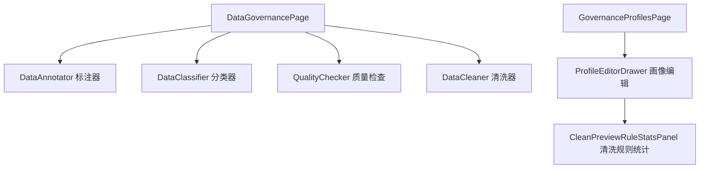

# 治理

## 功能概述

治理 (Governance) 界面提供数据质量管控、文档过期管理、治理规则包配置和治理画像编辑功能。

## 路由

| 路由 | 页面文件 | 功能 |
|------|----------|------|
| `/data-governance` | `app/data-governance/page.tsx` | 数据治理主页 |
| `/governance-admin` | `app/data-governance/page.tsx` | 治理管理 |

## 组件结构

## 核心 API

| 操作 | API | 说明 |
|------|-----|------|
| 规则包列表 | `governanceApi.listRulePacks()` | 治理规则包 |
| 过期文档 | `governanceApi.listStaleDocumentsByDataset()` | 过期文档列表 |
| 分块预设 | `chunkPresetApi.list / create / update / delete` | 分块策略预设 |

## 治理子功能

| 组件 | 功能 |
|------|------|
| `DataAnnotator` | 文档标注与元数据管理 |
| `DataClassifier` | 自动分类与标签分配 |
| `QualityChecker` | 质量规则检查与报告 |
| `DataCleaner` | 数据清洗预览与执行 |

## 治理画像

`GovernanceProfilesPage` 管理治理画像模板：
- 创建/编辑画像，定义清洗规则集合
- 预览清洗效果与规则命中统计
- 应用画像到数据集

:::info
治理功能需后端 `governance.enabled` 配置为 true。PII 脱敏和密钥脱除由 `SafetyConfig` 控制。
:::

## 相关链接

- [数据集 · 功能开关](../datasets/feature-flags.md) — Feature Flag
- [后端 · 治理](../../backend/more/platform.md) — 后端治理实现
