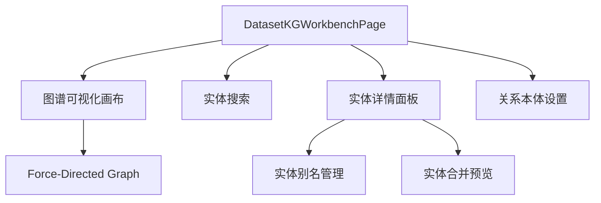

# 知识图谱

## 功能概述

知识图谱 (KG) 可视化界面提供图谱浏览、实体搜索、实体合并/拆分、关系本体管理等功能。

## 路由

| 路由 | 页面文件 | 功能 |
|------|----------|------|
| `/datasets/[id]/kg` | `app/datasets/[id]/kg/page.tsx` | 数据集 KG 工作台 |
| `/graph` | `app/graph/page.tsx` | 全局图谱浏览 |

## 组件结构

## 关键 API

| 操作 | API | 说明 |
|------|-----|------|
| KG 抽取 | `kgApi.extract()` | 从文档抽取实体关系 |
| 图谱查询 | `kgApi.getGraph()` | 获取图谱节点和边 |
| 图谱扩展 | `kgApi.expandGraph()` | 从节点展开邻居 |
| 实体搜索 | `kgApi.search()` | 搜索实体和事件 |
| 实体合并 | `kgApi.mergeEntities()` | 合并重复实体 |
| 实体拆分 | `kgApi.splitEntity()` | 拆分错误合并 |
| 别名管理 | `kgApi.createEntityAlias()` | 实体别名 CRUD |
| 关系本体 | `kgApi.listPredicateOntology()` | 关系谓词本体管理 |
| 统计 | `kgApi.getStats()` | 实体/关系数量统计 |

## 图谱可视化

DatasetKGWorkbenchPage（约 4.3 万字符）使用力导向图 (Force-Directed Graph) 渲染：
- **节点**: 实体，颜色按类型区分
- **边**: 关系，标签显示谓词
- **交互**: 点击节点查看详情、双击展开邻居、拖拽布局

:::info
KG 功能需后端 `kg_enabled` Feature Flag 开启。未开启时数据集详情页不显示 KG Tab。
:::

## 相关链接

- [检索与 RAG](./retrieval) — KG 增强检索
- [后端 · KG 管线](../../backend/more/platform.md) — KG 抽取与召回实现
