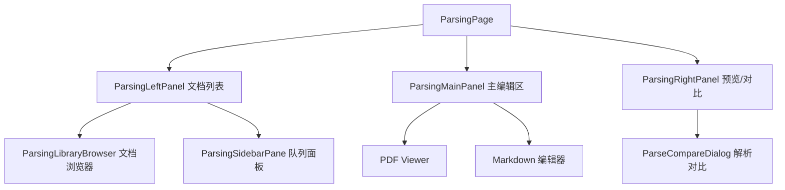

# 解析工作台

## 功能概述

解析工作台 (Parsing Workbench) 提供文档解析的可视化预览、对比和编辑功能。支持多种解析后端的结果预览与质量评估。

## 路由

| 路由 | 功能 |
|------|------|
| `/parsing` | 解析工作台主页面 |

## 组件结构

## 核心 Hooks

| Hook | 文件 | 职责 |
|------|------|------|
| `useParsingPageState` | `use-parsing-page-state.ts` | 页面全局状态 |
| `useParsingViewState` | `use-parsing-view-state.ts` | 视图状态（选中文档等） |
| `useParsingEditorActions` | `use-parsing-editor-actions.ts` | 编辑操作 |
| `useParsingRunActions` | `use-parsing-run-actions.ts` | 运行解析操作 |
| `useParsingQueueActions` | `use-parsing-queue-actions.ts` | 队列管理 |

## 解析后端选择

前端通过 `resolveParserBackendForFilename()` 自动选择解析器，用户也可手动切换。

| 解析器 | Feature Flag | 适用文件类型 |
|--------|-------------|-------------|
| `auto` | 始终可用 | 自动推断 |
| `deepdoc` | `deepdoc_enabled` | PDF |
| `docling` | `docling_enabled` | PDF / Office |
| `marker` | `marker_enabled` | PDF |
| `mineru` | `mineru_enabled` | PDF |
| `etl4llm` | `etl4llm_enabled` | PDF / Office |

:::tip
解析工作台支持同一文档使用不同解析器的结果对比，帮助选择最优解析策略。
:::

## 相关链接

- [后端 · 解析工作台](../../backend/more/platform.md) — 解析后端实现
- [文档管理 · 连接器配置](../documents/connectors-ui.md) — 连接器 UI
