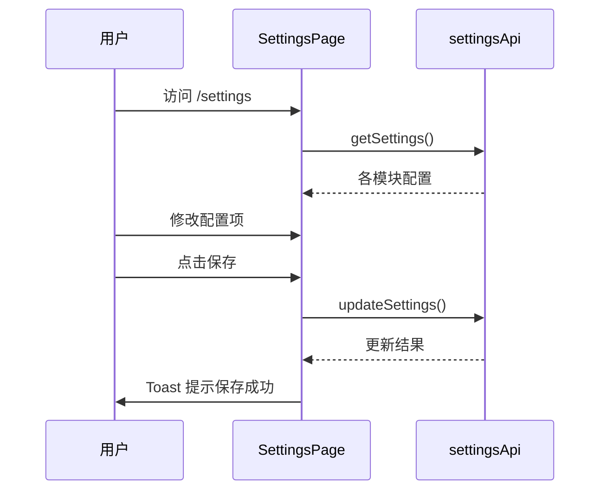

# 平台与账号

## 路由表

| 路由 | 页面文件 | 功能 |
|------|----------|------|
| `/settings` | `app/settings/page.tsx` | 系统设置面板 |
| `/access-review` | `app/access-review/page.tsx` | 访问审计 |
| `/audit` | `app/audit/page.tsx` | 操作审计日志 |
| `/usage` | `app/usage/page.tsx` | 用量统计 |
| `/auth` | `app/auth/page.tsx` | 登录 / SSO |

## 设置页功能

设置页面通过 `settingsApi` 获取和更新各子系统配置。

| 配置模块 | API 类型 | 说明 |
|----------|----------|------|
| Feature Flags | `FeatureFlags` | 功能开关（只读展示） |
| LLM 配置 | `LLMConfig` | 模型、API Key、温度等 |
| Embedding 配置 | `EmbeddingConfig` | 嵌入模型与 Provider |
| Milvus 配置 | `MilvusConfig` | 向量库连接 |
| RAG 配置 | `RAGConfig` | 分块大小、检索 Top-K 等 |
| 缓存配置 | `CacheConfig` | 对话缓存策略 |
| 治理配置 | `GovernanceConfig` | PII / 密钥脱敏 |
| 安全配置 | `SafetyConfig` | PII 检测与脱敏 |
| 可观测配置 | `ObservabilityConfig` | 日志与 Trace |

## 设置页数据流

## RBAC 管理

`web/lib/api/access.ts` 提供 RBAC 与分组管理 API：

| API | 说明 |
|-----|------|
| `rbacApi.listTenantMembers()` | 租户成员列表 |
| `rbacApi.patchTenantMemberRole()` | 修改成员角色 |
| `groupApi.listGroups()` | 分组列表 |
| `groupApi.createGroup()` | 新建分组 |

:::info
RBAC 角色变更后需用户重新登录或刷新 Token 才生效。
:::

:::warning
修改 LLM / Embedding 配置后，已有的向量索引不会自动重建。切换嵌入模型后需对数据集执行 reingest。
:::

## 相关链接

- [后端 · 平台配置](../../backend/more/platform.md) — 后端平台设置
