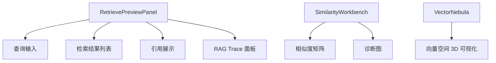

# 检索与 RAG

## 功能概述

检索与 RAG 调试界面提供检索预览、Trace 查看、相似度可视化等工具，帮助开发者调优检索效果。

## 路由

| 路由 | 页面文件 | 功能 |
|------|----------|------|
| `/knowledge/retrieval` | — | 检索证据入口 |
| `/knowledge/similarity` | — | 相似度诊断 |
| `/knowledge/nebula` | — | 向量星云可视化 |

## 核心组件

## 关键交互

| 操作 | API | 说明 |
|------|-----|------|
| 检索预览 | `ragApi.retrievePreview()` | 单次检索调试 |
| Prompt 预览 | `ragApi.promptPreview()` | 查看最终 Prompt |
| RAG Trace | `chatApi.getRagTraces()` | 检索链路追踪 |
| 相似度计算 | `ragApi.calculateSimilarity()` | 文档/Chunk 相似度 |
| CLIP 图片搜索 | `ragApi.clipImageSearch()` | 多模态检索 |
| 配置模板 | `ragApi.listConfigTemplates()` | RAG 配置模板管理 |

## RAG Trace 面板

`RagTracePanel` 组件展示单次检索的完整链路：

| 面板 | 内容 |
|------|------|
| Pipeline Timeline | 各阶段耗时瀑布图 |
| Channel Scores | 各检索通道得分对比 |
| Retrieval Config Hash | 配置指纹 |
| 引用列表 | 命中的 Chunk 与得分 |

:::info
RetrievePreviewPanel 是最大的单组件之一（约 1500 行），集成了检索预览的全部功能。
:::

## 相关链接

- [对话](./chat) — 对话中的检索调用
- [后端 · 检索引擎](../../backend/more/platform.md) — HybridRetriever 实现
