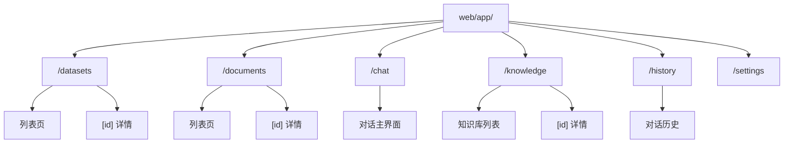

# 前端手册总览

本手册面向 **前端开发者与全栈工程师**，帮助你理解 MimirQ Web 端的路由结构、组件体系与 API 调用层。类型与路径以 [OpenAPI / Redoc](https://skygazer42.github.io/MimirQ/) 为权威参考，前端路由以 `web/app/**/page.tsx` 为准。

## 技术栈

| 层级 | 技术 | 说明 |
| --- | --- | --- |
| 框架 | Next.js 14 | App Router |
| UI 库 | React 19 | Server & Client Components |
| 语言 | TypeScript 5.x | 严格模式 |
| 样式 | Tailwind CSS | utility-first |
| 组件库 | shadcn/ui | 基于 Radix UI |
| 数据获取 | TanStack Query | 渐进迁移中（部分仍用 useEffect 手动 fetch） |
| 状态管理 | Zustand | 轻量全局状态 |
| 国际化 | next-intl | 中英双语 |
| 包管理 | pnpm | workspace |

## 路由树

## 页面路由总览

| 路由 | 页面 | 核心组件 |
| --- | --- | --- |
| `/datasets` | 数据集列表 | `datasets-page.tsx` |
| `/datasets/[id]` | 数据集详情 | `dataset-categories/category-tree.tsx` |
| `/documents` | 文档管理 | — |
| `/chat` | 对话界面 | `chat-area.tsx`, `message-item.tsx` |
| `/knowledge` | 知识库 | `knowledge-page.tsx`, `knowledge-inspector.tsx` |
| `/history` | 对话历史 | `page-client.tsx` |
| `/settings` | 系统设置 | — |

## API 封装模块

所有后端调用集中在 `web/lib/api/` 目录：

| 文件 | 职责 |
| --- | --- |
| `core.ts` | 请求基础层（fetch 封装、错误处理、认证 header） |
| `datasets.ts` | 数据集 CRUD |
| `documents.ts` | 文档上传、解析、状态 |
| 其他模块 | 按业务域拆分 |

:::info 类型生成
`web/types/openapi.ts` 由 openapi-typescript 自动生成，`web/types/backend.ts` 提供别名映射。后端 Schema 变更后需运行 `openapi-export` 重新生成。
:::

## 状态管理策略

| 方式 | 场景 | 现状 |
| --- | --- | --- |
| TanStack Query | 服务端数据缓存与同步 | 8 个文件使用 `useQuery`，正在扩展 |
| Zustand | 纯前端全局状态（UI 偏好等） | 轻量使用 |
| `useEffect` + `useState` | 手动 fetch | 历史遗留，逐步迁移到 TanStack Query |

:::tip 迁移方向
新功能请优先使用 TanStack Query 的 `useQuery` / `useMutation`，QueryProvider 已配置在 `layout.tsx` 中。
:::

## 关键组件地图

| 组件 | 路径 | 说明 |
| --- | --- | --- |
| ChatArea | `web/components/chat-area.tsx` | 对话核心区域，SSE streaming |
| MessageItem | `web/components/chat/message-item.tsx` | 单条消息渲染（含 Markdown） |
| KnowledgePage | `web/components/knowledge/knowledge-page.tsx` | 知识库主页 |
| KnowledgeInspector | `web/components/knowledge/knowledge-inspector.tsx` | 知识库检查器 |
| CategoryTree | `web/components/dataset-categories/category-tree.tsx` | 数据集分类树 |
| DatasetsPage | `web/components/datasets/datasets-page.tsx` | 数据集列表 |

## 建议阅读顺序

:::tip 阅读路线
1. **本页** -- 全局视图
2. **数据集** -- [概述](./datasets/overview) → [API Client](./datasets/api-client) → [UI 组件](./datasets/catalog-ui)
3. **文档** -- [概述](./documents/overview) → [API Client](./documents/api-client) → [状态 UI](./documents/state-ui)
4. **更多模块** -- [Chat](./more/chat) → [Knowledge](./more/retrieval) → [KG](./more/kg)
5. **排障** -- 各域 `troubleshooting` / `errors` 页
:::

## 相关链接

- [OpenAPI / Redoc](https://skygazer42.github.io/MimirQ/)
- [后端视角总览](../backend/welcome)
- [集成与联调总览](../integration/welcome)
- [运维总览](../ops/welcome)
