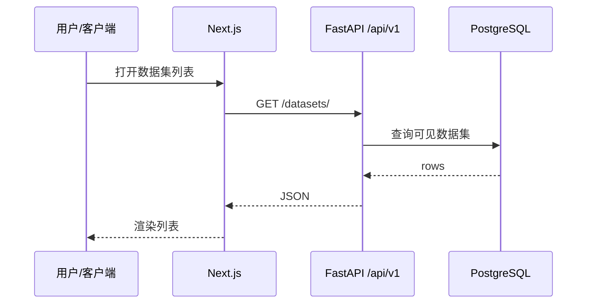

# 数据集 — 典型 E2E 序列

## 环境变量

对齐后端 `.env` 与前端 `NEXT_PUBLIC_*`（参见仓库 `docs/deployment` 与 Settings 页说明）。

## 排障入口

- [FE_BE_DEBUG.md](https://github.com/skygazer42/MimirQ/blob/main/docs/integration/FE_BE_DEBUG.md)
- [API_CONTRACT.md](https://github.com/skygazer42/MimirQ/blob/main/docs/integration/API_CONTRACT.md)
