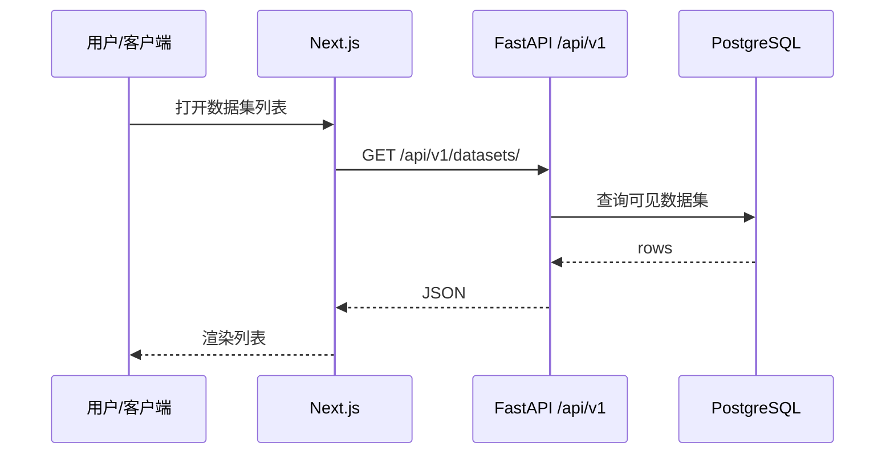

# 数据集 — 典型 E2E 序列

## 序列图（列表）

## 推荐手工回归步骤

1. **登录** 获取 `Authorization: Bearer`（或开发 Header 模式，仅非生产）。
2. **列表**：`GET /api/v1/datasets/?skip=0&limit=20`，确认分页与租户可见性。
3. **创建**：`POST /api/v1/datasets/`，body 至少包含 OpenAPI 要求的 `name` 等字段。
4. **详情**：`GET /api/v1/datasets/{dataset_id}`，与列表中 id 一致。
5. **更新**：`PATCH /api/v1/datasets/{dataset_id}`，必要时处理 409。
6. **子能力**（按需）：健康 `.../health`、预检/画像 scan-runs、入库策略等（见 Backend 侧 **API 参考索引**）。

## 常见失败与定位

| 现象 | 建议 |
| --- | --- |
| 列表空 | Token、租户、权限；对比 Redoc 与 [FE_BE_DEBUG](https://github.com/skygazer42/MimirQ/blob/main/docs/integration/FE_BE_DEBUG.md) |
| 422 | 请求体与 **DatasetCreate** / **DatasetUpdate** 字段不一致 |
| 子资源 404 | `dataset_id` 错误或无权访问 |

## 环境变量

对齐后端 `.env` 与前端 `NEXT_PUBLIC_*`（参见仓库 `docs/deployment` 与 Settings 页说明）。

## 排障入口

- [FE_BE_DEBUG.md](https://github.com/skygazer42/MimirQ/blob/main/docs/integration/FE_BE_DEBUG.md)
- [API_CONTRACT.md](https://github.com/skygazer42/MimirQ/blob/main/docs/integration/API_CONTRACT.md)
