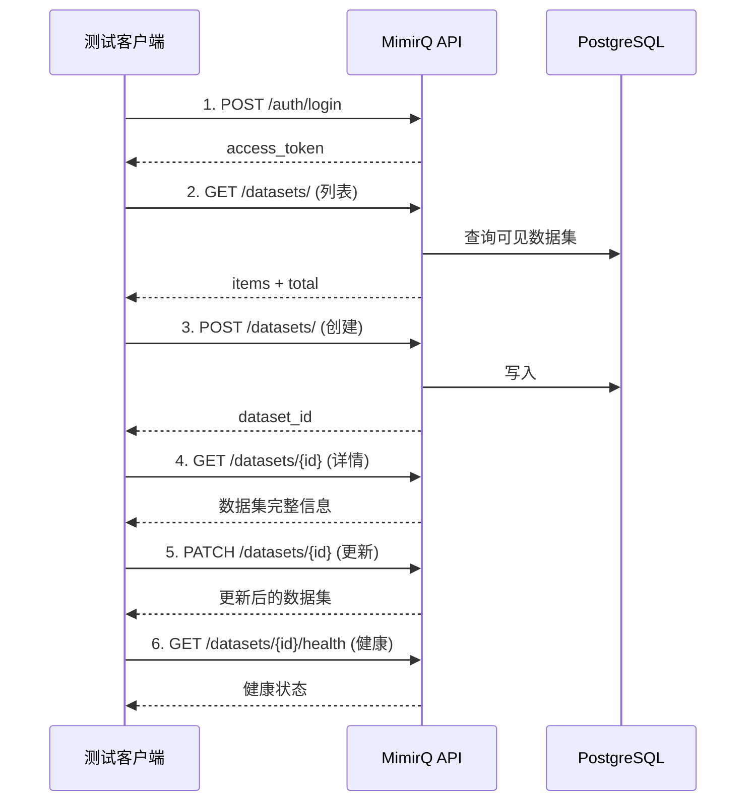

# 数据集端到端测试

数据集 CRUD 与子能力的完整手工回归测试脚本。

## 序列图



## 测试步骤

### Step 1 — 认证

```bash
TOKEN=$(curl -s -X POST "$BASE_URL/api/v1/auth/login" \
  -H "Content-Type: application/json" \
  -d '{"username": "test@example.com", "password": "password"}' | jq -r '.access_token')
```

### Step 2 — 列表查询

```bash
# 查询数据集列表，验证分页与租户可见性
curl -s "$BASE_URL/api/v1/datasets/?skip=0&limit=20" \
  -H "Authorization: Bearer $TOKEN" | jq '{total, count: (.items | length)}'
```

验证点：
- [ ] 返回 200，`items` 为数组
- [ ] `total` 与 `items` 长度关系正确
- [ ] 仅包含当前租户可见的数据集

### Step 3 — 创建数据集

```bash
DATASET_ID=$(curl -s -X POST "$BASE_URL/api/v1/datasets/" \
  -H "Authorization: Bearer $TOKEN" \
  -H "Content-Type: application/json" \
  -d '{"name": "e2e-test-dataset", "description": "E2E 测试用数据集"}' | jq -r '.id')
echo "Created: $DATASET_ID"
```

验证点：
- [ ] 返回 201（或 200），包含 `id` 字段
- [ ] `name` 与请求一致

### Step 4 — 查询详情

```bash
curl -s "$BASE_URL/api/v1/datasets/$DATASET_ID" \
  -H "Authorization: Bearer $TOKEN" | jq '{id, name, description, created_at}'
```

验证点：
- [ ] 返回数据与创建时一致
- [ ] 在列表接口中可以查到该数据集

### Step 5 — 更新数据集

```bash
curl -s -X PATCH "$BASE_URL/api/v1/datasets/$DATASET_ID" \
  -H "Authorization: Bearer $TOKEN" \
  -H "Content-Type: application/json" \
  -d '{"description": "更新后的描述"}' | jq '{id, description}'
```

验证点：
- [ ] `description` 已更新
- [ ] 并发更新场景下处理 409（如适用）

### Step 6 — 子能力验证

```bash
# 健康检查
curl -s "$BASE_URL/api/v1/datasets/$DATASET_ID/health" \
  -H "Authorization: Bearer $TOKEN" | jq .

# 预检配置（如适用）
curl -s "$BASE_URL/api/v1/datasets/$DATASET_ID/precheck" \
  -H "Authorization: Bearer $TOKEN" | jq .
```

## 常见失败与定位

| 现象 | 原因 | 建议 |
|------|------|------|
| 列表为空 | Token 或租户不正确 | 检查认证与租户上下文 |
| 创建 422 | 请求体字段与 OpenAPI 不匹配 | 对照 [Redoc](https://skygazer42.github.io/MimirQ/) |
| 子资源 404 | `dataset_id` 错误或无权访问 | 核对 ID 与权限 |
| 更新 409 | 并发冲突 | 重新 GET 后再 PATCH |

## 清理

```bash
# 测试完成后删除测试数据集
curl -X DELETE "$BASE_URL/api/v1/datasets/$DATASET_ID" \
  -H "Authorization: Bearer $TOKEN"
```

## 相关链接

- [Redoc — API 完整参考](https://skygazer42.github.io/MimirQ/)
- [文档 E2E](../documents/e2e.md) | [错误码](../patterns/errors-4xx-5xx.md)
- [分页模式](../patterns/pagination.md)
