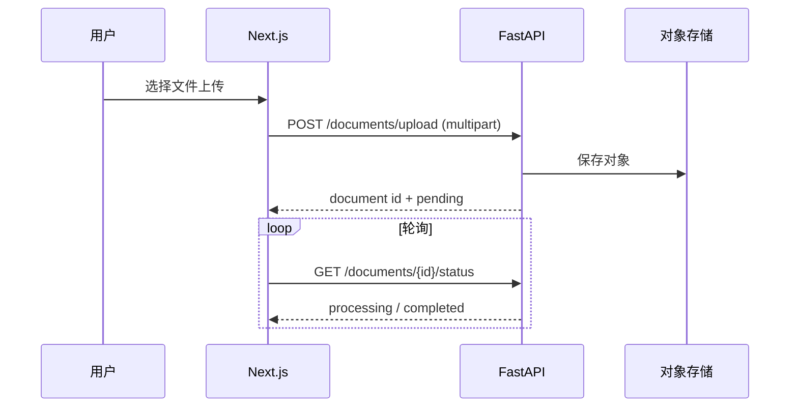

# 文档 — 典型 E2E 序列

```mermaid
sequenceDiagram
  participant U as 用户
  participant FE as Next.js
  participant API as FastAPI
  participant Store as 对象存储
  U->>FE: 选择文件上传
  FE->>API: POST /documents/upload (multipart)
  API->>Store: 保存对象
  API-->>FE: document id + pending
  loop 轮询
    FE->>API: GET /documents/{id}/status
    API-->>FE: processing / completed
  end
```

## 契约检查

上传字段名、Content-Type 与 OpenAPI 一致；异常体格式见 API 文档索引。
