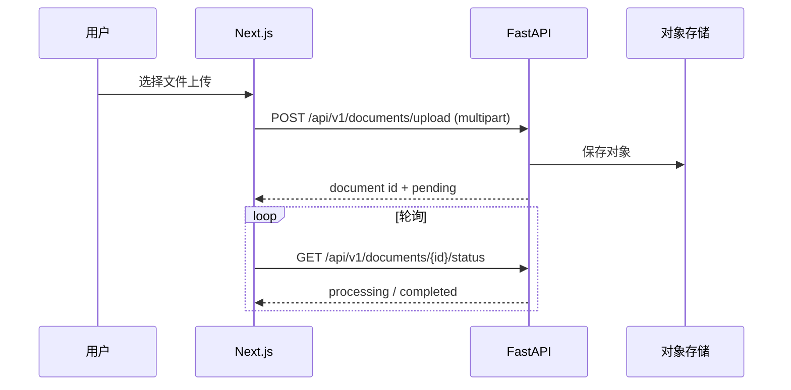

# 文档 — 典型 E2E 序列

## 序列图（上传 + 轮询）

## 推荐手工回归步骤

1. **认证** 与数据集上下文（若上传需要 `dataset_id`，以 OpenAPI 为准）。
2. **上传**：`POST /api/v1/documents/upload`，`multipart/form-data`，字段名与 Redoc 一致。
3. **状态**：轮询 `GET /api/v1/documents/{document_id}/status`，直至终态或失败。
4. **详情 / 分块**（按需）：`GET /api/v1/documents/{document_id}`、`GET .../chunks`。
5. **解析文本**（按需）：`GET .../parsed-content`（需流水线完成）。

## 契约检查

- 上传字段名、Content-Type 与 OpenAPI **Body_upload_...** 一致。
- 异常体格式与 HTTP 状态码对照 [集成模式 — 错误码](../patterns/errors-4xx-5xx.md)。

## 常见失败与定位

| 现象 | 建议 |
| --- | --- |
| 415 / 400 | MIME、字段名、文件大小；见 Backend **文档 — 排障** |
| 一直 processing | 解析器与队列；`timeline` / 后端日志 |
| 前端无响应 | SSE/代理缓冲（若走流式预览）；见 **集成模式 — SSE** |

## 相关链接

- [API 契约说明](https://github.com/skygazer42/MimirQ/blob/main/docs/integration/API_CONTRACT.md)
- [FE_BE_DEBUG.md](https://github.com/skygazer42/MimirQ/blob/main/docs/integration/FE_BE_DEBUG.md)
