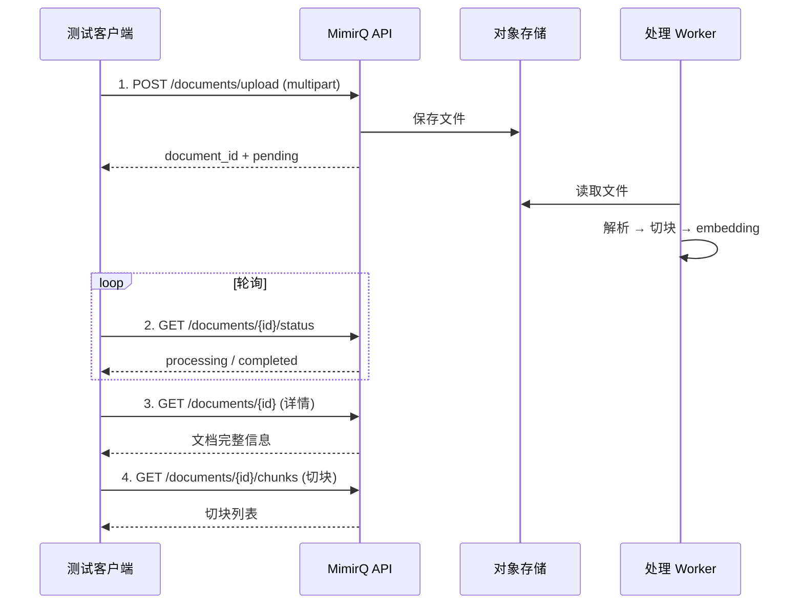

# 文档端到端测试

文档上传、状态轮询、内容查看的完整手工回归测试脚本。

## 序列图



## 测试步骤

### Step 1 — 认证与准备

```bash
TOKEN=$(curl -s -X POST "$BASE_URL/api/v1/auth/login" \
  -H "Content-Type: application/json" \
  -d '{"username": "test@example.com", "password": "password"}' | jq -r '.access_token')

# 确保有可用的数据集
DATASET_ID="your-dataset-id"
```

### Step 2 — 上传文档

```bash
DOC_ID=$(curl -s -X POST "$BASE_URL/api/v1/documents/upload" \
  -H "Authorization: Bearer $TOKEN" \
  -F "file=@test-document.pdf" \
  -F "dataset_id=$DATASET_ID" | jq -r '.id')
echo "Uploaded: $DOC_ID"
```

验证点：
- [ ] 返回包含 `id` 字段
- [ ] 初始状态为 `pending`
- [ ] Content-Type 自动为 `multipart/form-data`（不要手动设置）

### Step 3 — 轮询状态

```bash
for i in $(seq 1 60); do
  STATUS=$(curl -s "$BASE_URL/api/v1/documents/$DOC_ID/status" \
    -H "Authorization: Bearer $TOKEN" | jq -r '.status')
  echo "[$i] Status: $STATUS"
  [ "$STATUS" = "completed" ] || [ "$STATUS" = "failed" ] && break
  sleep 5
done
```

验证点：
- [ ] 状态流转：`pending` → `processing` → `completed`
- [ ] 处理时间在合理范围内（小文件 < 2 分钟）
- [ ] 如果 `failed`，错误信息有意义

### Step 4 — 查看详情

```bash
curl -s "$BASE_URL/api/v1/documents/$DOC_ID" \
  -H "Authorization: Bearer $TOKEN" | jq '{id, name, status, chunks_count, created_at}'
```

验证点：
- [ ] 文档名称与上传文件一致
- [ ] `chunks_count` > 0（处理完成后）

### Step 5 — 查看切块

```bash
curl -s "$BASE_URL/api/v1/documents/$DOC_ID/chunks?limit=5" \
  -H "Authorization: Bearer $TOKEN" | jq '.items[] | {id, content: .content[:100]}'
```

验证点：
- [ ] 切块内容与原文档内容对应
- [ ] 切块有有效的 `id`，可用于后续引用

### Step 6 — 查看解析内容（可选）

```bash
curl -s "$BASE_URL/api/v1/documents/$DOC_ID/parsed-content" \
  -H "Authorization: Bearer $TOKEN" | jq '{text_length: (.text | length)}'
```

## 契约检查

- [ ] 上传字段名与 OpenAPI `Body_upload_...` 定义一致
- [ ] 状态值属于 OpenAPI 中定义的枚举
- [ ] 错误响应格式与 `ErrorResponse` schema 一致

## 常见失败与定位

| 现象 | 原因 | 建议 |
|------|------|------|
| 415 / 400 | MIME 类型不支持或字段名错误 | 检查文件格式与上传字段 |
| 一直 processing | 解析器或 Worker 异常 | 参见 [文档卡住排障](../tasks/document-stuck.md) |
| 切块为空 | Pipeline 配置问题 | 检查切块参数 |
| 前端无响应 | SSE/代理缓冲（走流式预览时） | 参见 [SSE 流式](../patterns/sse-streaming.md) |

## 清理

```bash
# 测试完成后删除测试文档
curl -X DELETE "$BASE_URL/api/v1/documents/$DOC_ID" \
  -H "Authorization: Bearer $TOKEN"
```

## 相关链接

- [Redoc — API 完整参考](https://skygazer42.github.io/MimirQ/)
- [数据集 E2E](../datasets/e2e.md) | [文件上传](../patterns/multipart-upload.md)
- [场景: 上传后对话](../scenarios/s01-upload-chat.md)
