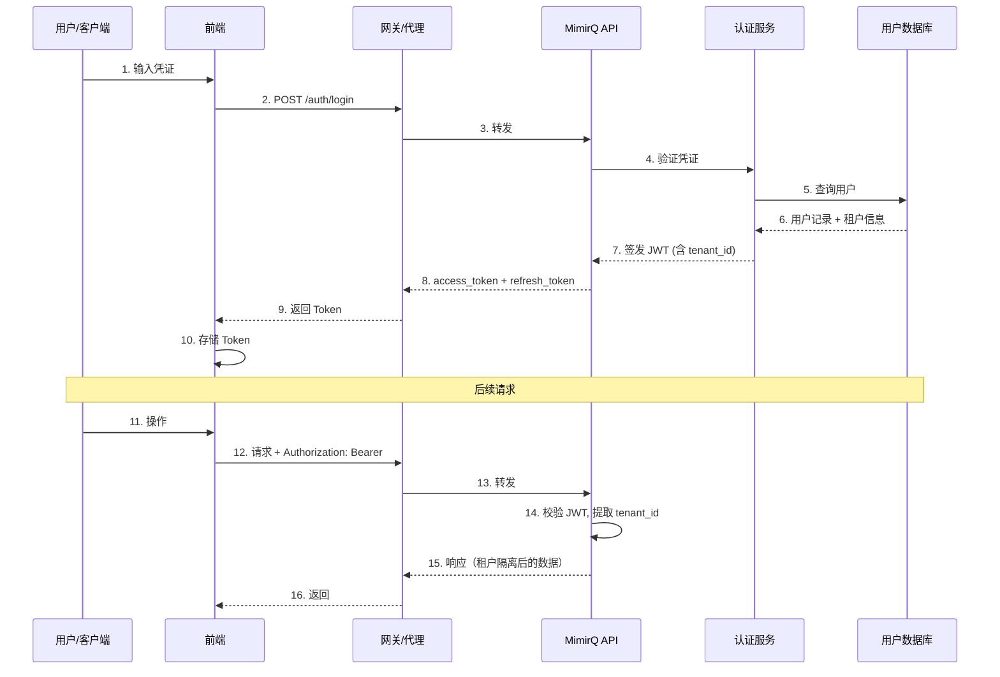
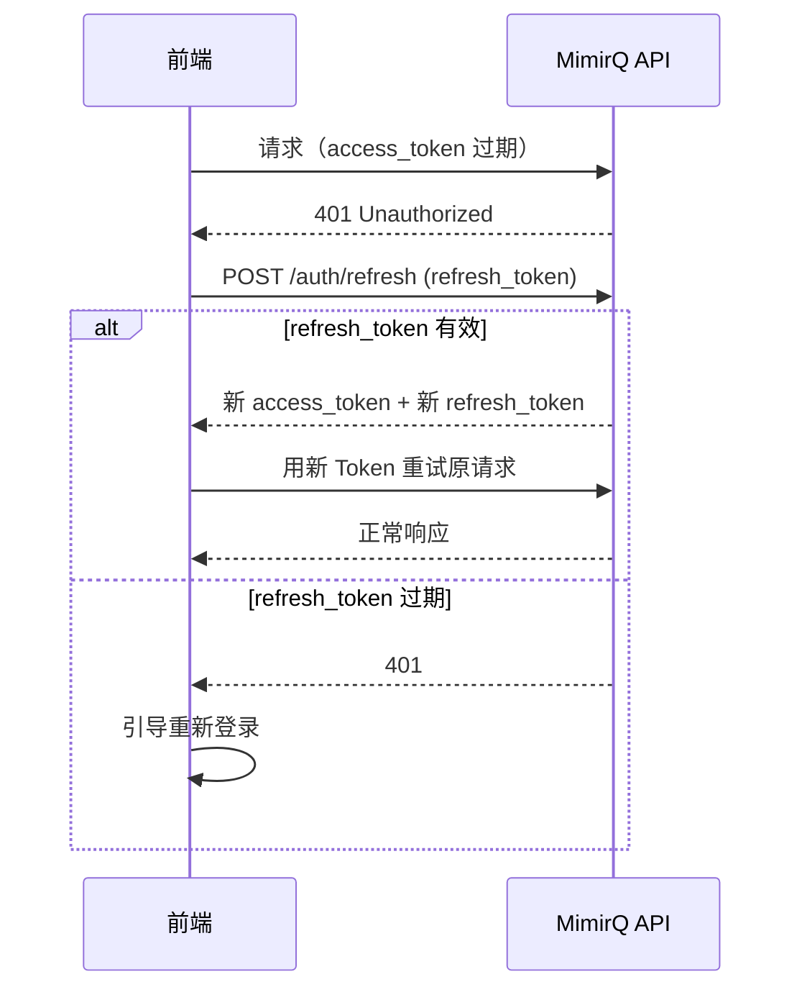

# 认证与租户流程详解

MimirQ 认证与租户上下文从登录到请求的完整生命周期。

## 认证时序图



## Token 刷新流程



## 租户上下文注入

### 生产模式

JWT claims 中自动包含租户信息：

```
Authorization: Bearer eyJhbGci...
  -> JWT payload: { sub: "user-123", tenant_id: "tenant-abc", roles: ["admin"] }
  -> API 层自动提取 tenant_id，所有查询加租户过滤
```

### 开发模式

开发环境可通过 Header 直接注入：

```
X-User-ID: dev-user
X-Tenant-ID: dev-tenant
```

:::danger
生产环境**必须禁用** Header 调试模式。网关应拒绝包含 `X-User-ID` / `X-Tenant-ID` Header 的请求（非 JWT 来源）。
:::

## 多租户安全边界

| 层级 | 隔离机制 | 说明 |
|------|----------|------|
| 认证层 | JWT claims | Token 中携带 tenant_id |
| 中间件 | 请求上下文注入 | 每个请求绑定租户 |
| 数据层 | 查询过滤 | 所有 SQL/向量查询加 tenant_id 条件 |
| 存储层 | 路径隔离 | 对象存储按租户分桶/目录 |

## 越权防护要点

- JWT 过期后**不允许使用旧 Token**，确保时钟同步（NTP）
- 租户 ID 从 JWT 中提取，**不信任客户端 Header**
- 资源不可见时返回 404 而非 403，防止枚举攻击
- 超级管理员权限需额外审批流程

## 常见问题

| 问题 | 解决方案 |
|------|----------|
| 间歇性 401 | 检查服务端与客户端时钟同步 |
| Token 刷新循环 | refresh_token 也过期，需重新登录 |
| 跨租户数据可见 | 紧急排查 JWT 签发与中间件逻辑 |

## 相关链接

- [Redoc — API 完整参考](https://skygazer42.github.io/MimirQ/)
- [认证模式](../patterns/auth-modes.md) | [租户 Header](../patterns/tenant-headers.md)
- [场景: 多租户隔离](../scenarios/s14-multi-tenant.md)
