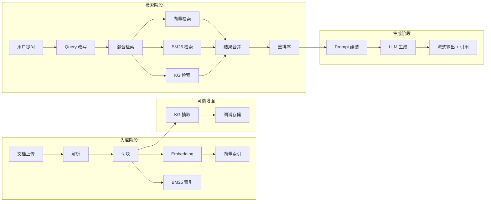
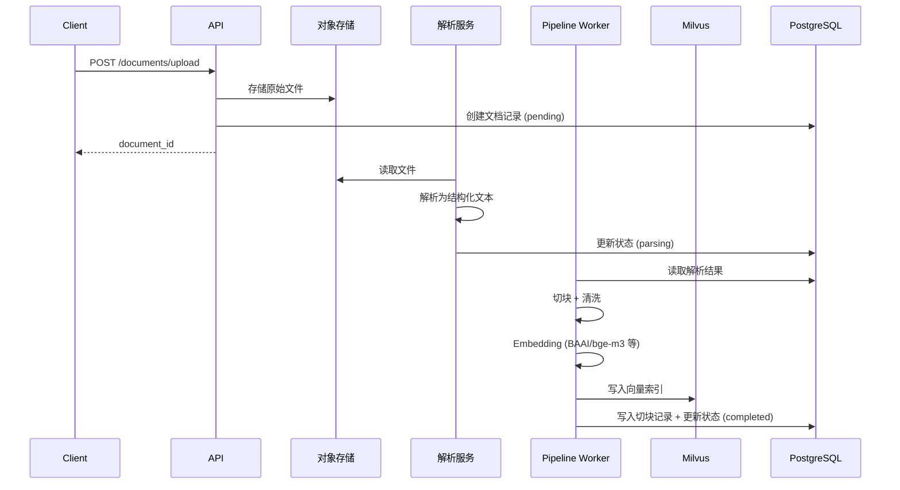
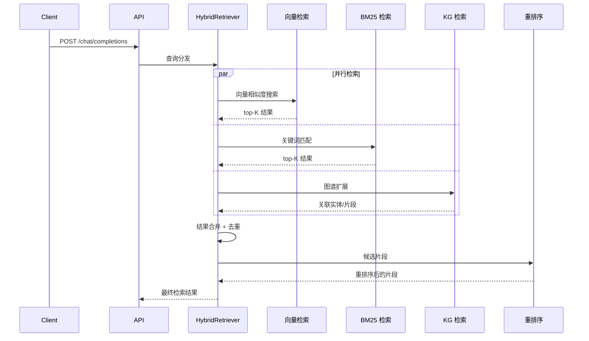
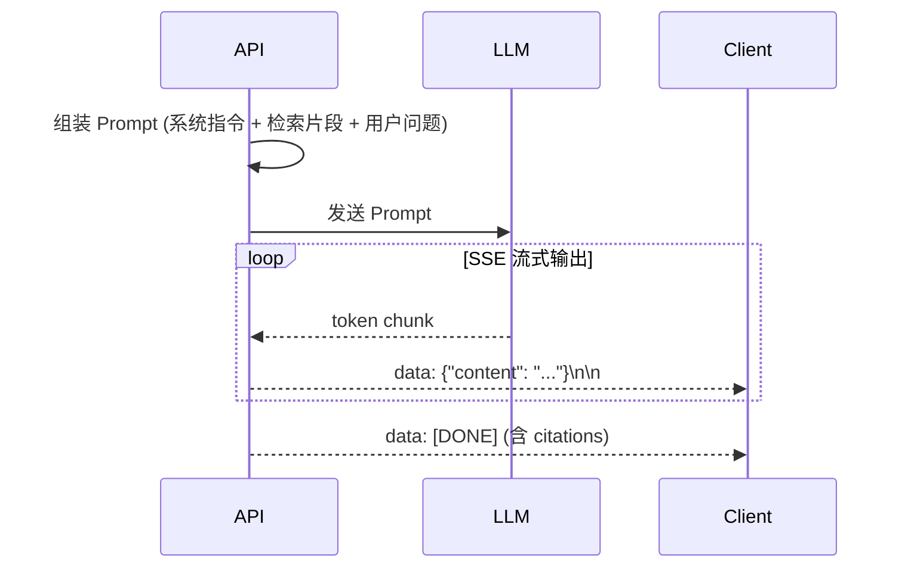

# RAG 端到端数据流

从文档入库到对话检索与生成的完整数据流，帮助理解 MimirQ 各组件如何协作。

## 全流程总览

## 入库阶段详解

### 各阶段说明

| 阶段 | 组件 | 输入 | 输出 |
|------|------|------|------|
| 上传 | API Server | 原始文件 | document_id + 对象存储路径 |
| 解析 | Parser Service | 原始文件 | 结构化文本 + 元数据 |
| 切块 | Pipeline Worker | 结构化文本 | 文本片段列表 |
| Embedding | Pipeline Worker | 文本片段 | 向量表示 |
| 索引 | Milvus + PostgreSQL | 向量 + 文本 | 可检索的索引 |

## 检索阶段详解

### 混合检索策略

MimirQ 采用 HybridRetriever，支持多路召回：

| 检索路 | 方法 | 擅长场景 |
|--------|------|----------|
| 向量检索 | 语义相似度（ANN） | 语义匹配、同义表达 |
| BM25 | 关键词匹配 | 精确术语、专有名词 |
| SPLADE | 稀疏向量 | 兼顾语义与关键词 |
| KG | 图谱关系扩展 | 实体关联、多跳推理 |

## 生成阶段详解

## 关键配置参数

| 参数 | 影响阶段 | 说明 |
|------|----------|------|
| `chunk_size` | 切块 | 片段大小，影响检索粒度 |
| `embedding_model` | Embedding | 向量模型选择 |
| `top_k` | 检索 | 各路召回数量 |
| `rerank_model` | 重排序 | 重排模型选择 |
| `temperature` | 生成 | LLM 生成随机性 |

## 相关链接

- [Redoc — API 完整参考](https://skygazer42.github.io/MimirQ/)
- [场景: 上传后对话](../scenarios/s01-upload-chat.md) | [场景: 检索调试](../scenarios/s04-retrieval-debug.md)
- [认证流程](./auth-flow.md)
