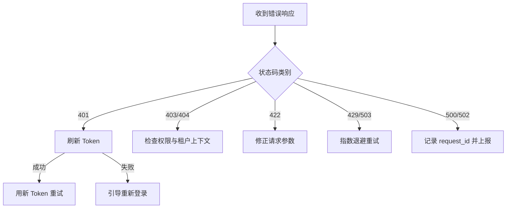

# HTTP 错误码与响应体

MimirQ API 遵循标准 HTTP 状态码语义，错误响应包含结构化的错误信息，便于客户端分类处理。

## 错误响应格式

```json
{
  "detail": "Dataset not found",
  "code": "RESOURCE_NOT_FOUND",
  "request_id": "req-abc-123"
}
```

:::info
具体字段名以 [Redoc](https://skygazer42.github.io/MimirQ/) 中 `ErrorResponse` schema 为准。部分接口可能包含额外的 `field` 或 `errors` 数组字段。
:::

## 错误码速查表

### 4xx 客户端错误

| 状态码 | 含义 | 常见原因 | 客户端动作 |
|--------|------|----------|------------|
| 400 | Bad Request | 请求格式错误、字段缺失 | 检查请求体与 Content-Type |
| 401 | Unauthorized | Token 缺失或过期 | 刷新 Token 或重新登录 |
| 403 | Forbidden | 权限不足、功能未授权 | 确认角色与 ACL 配置 |
| 404 | Not Found | 资源不存在或不可见 | 核对 ID 与租户上下文 |
| 409 | Conflict | 并发更新、唯一约束冲突 | 重新获取资源后重试 |
| 413 | Payload Too Large | 上传文件超过限制 | 压缩文件或调整限制 |
| 415 | Unsupported Media Type | 文件格式不支持 | 确认 MIME 类型 |
| 422 | Unprocessable Entity | Pydantic 校验失败 | 对照 Redoc 检查字段名与类型 |
| 429 | Too Many Requests | 触发限流 | 指数退避重试 |

### 5xx 服务端错误

| 状态码 | 含义 | 常见原因 | 客户端动作 |
|--------|------|----------|------------|
| 500 | Internal Server Error | 应用异常 | 记录 request_id 并反馈 |
| 502 | Bad Gateway | 代理后端不可达 | 检查服务部署状态 |
| 503 | Service Unavailable | 服务过载或依赖不可用 | 退避重试，检查健康探针 |

## 错误处理策略



### 重试决策

| 状态码 | 是否重试 | 策略 |
|--------|----------|------|
| 401 | 刷新 Token 后重试一次 | 刷新失败则停止 |
| 409 | 获取最新状态后重试 | 仅限幂等操作 |
| 429 | 是 | 指数退避 + 抖动 |
| 500 | 谨慎重试 | 非幂等操作不重试 |
| 502/503 | 是 | 指数退避，最多 3 次 |

:::warning
对**非幂等的 POST** 请求（如创建数据集、上传文档），收到 5xx 后盲目重试可能导致重复资源。确认支持幂等键或接受重复后再重试。参见 [重试与幂等](./idempotency-retries.md)。
:::

## 前端错误处理建议

- 对高频错误（401、422）提供用户可理解的反馈
- 响应中包含 `request_id` 时，在错误提示中展示（便于后端定位）
- 未知错误码不应静默吞掉，至少记录到控制台

## 相关链接

- [Redoc — API 完整参考](https://skygazer42.github.io/MimirQ/)
- [重试与幂等](./idempotency-retries.md) | [可观测性](./observability-requests.md)
- [认证模式](./auth-modes.md) | [租户 Header](./tenant-headers.md)
