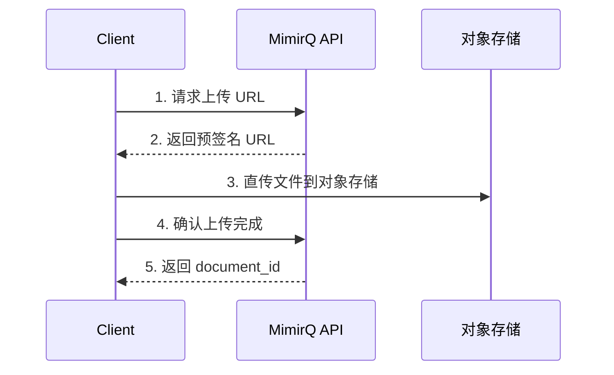

# 文件上传

MimirQ 通过 `multipart/form-data` 接口上传文档，支持 PDF、Office、纯文本等格式。大文件场景可使用预签名 URL 直传对象存储。

## multipart/form-data 上传

### 基本示例

```bash
curl -X POST "$BASE_URL/api/v1/documents/upload" \
  -H "Authorization: Bearer $TOKEN" \
  -F "file=@document.pdf" \
  -F "dataset_id=$DATASET_ID"
```

:::warning 字段名
`file` 等表单字段名必须与 [Redoc](https://skygazer42.github.io/MimirQ/) 中 **documents** 分组的定义严格一致。使用错误的字段名会返回 400 或 415。
:::

### Content-Type 注意事项

- 使用 `curl -F` 时 Content-Type 自动设置为 `multipart/form-data`
- **不要手动设置** Content-Type Header，否则 boundary 参数会丢失
- 编程语言中使用对应的 multipart 库（如 Python `requests` 的 `files` 参数）

```python
import requests

resp = requests.post(
    f"{BASE_URL}/api/v1/documents/upload",
    headers={"Authorization": f"Bearer {token}"},
    files={"file": ("document.pdf", open("document.pdf", "rb"), "application/pdf")},
    data={"dataset_id": dataset_id}
)
```

## 大文件处理

### 体积限制

上传体积受**双重约束**：

| 层级 | 配置项 | 典型默认值 |
|------|--------|-----------|
| 反向代理 | Nginx `client_max_body_size` | 100M |
| 后端应用 | 应用配置 | 以部署文档为准 |

:::tip
如果上传返回 413（Request Entity Too Large），优先检查反向代理配置。
:::

### 预签名 URL 上传

对于大文件，部分部署支持预签名 URL 直传对象存储：



具体路径（如 `upload-url`、`batch-upload`）以 OpenAPI 定义为准。

## 批量上传

多文件上传建议：
- 串行上传，每次一个文件，避免并发过高导致 429
- 记录每个文件的 `document_id`，批量轮询状态
- 失败文件单独重试，不影响已成功的文件

## 排障

| 状态码 | 原因 | 解决方案 |
|--------|------|----------|
| 400 | 字段名错误或缺少必填参数 | 对照 Redoc 检查字段名 |
| 413 | 文件超过代理/应用限制 | 调整 `client_max_body_size` |
| 415 | 不支持的文件格式 | 确认文件 MIME 类型 |
| 422 | 参数校验失败 | 检查 `dataset_id` 等字段 |

## 相关链接

- [Redoc — API 完整参考](https://skygazer42.github.io/MimirQ/)
- [场景: 上传后对话](../scenarios/s01-upload-chat.md)
- [错误码与响应体](./errors-4xx-5xx.md) | [认证模式](./auth-modes.md)
