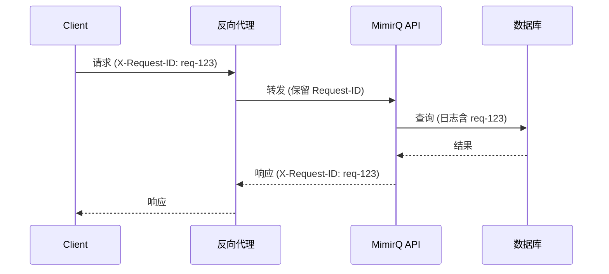

# 请求追踪与可观测性

通过 Request-ID 关联前端、网关与后端日志，实现跨层级的故障定位。

## Request-ID 关联

MimirQ 在响应中返回 `X-Request-ID`（或类似 Header），可用于跨层日志关联：



### 客户端发送 Request-ID

```bash
curl "$BASE_URL/api/v1/datasets/" \
  -H "Authorization: Bearer $TOKEN" \
  -H "X-Request-ID: $(uuidgen)"
```

如果客户端不发送，服务端会自动生成。

### 错误场景中的日志关联

```bash
# 请求失败时记录 Request-ID
response=$(curl -s -w "\n%{http_code}" "$BASE_URL/api/v1/datasets/$ID" \
  -H "Authorization: Bearer $TOKEN")

status_code=$(echo "$response" | tail -1)
if [ "$status_code" -ge 400 ]; then
  echo "Error $status_code — 请将 Request-ID 提供给后端排查"
fi
```

## 健康检查

| 端点 | 用途 | 建议间隔 |
|------|------|----------|
| `GET /api/v1/health` | 存活探针（进程存活） | 10s |
| `GET /api/v1/health/ready` | 就绪探针（依赖可用） | 5s |

### K8s 探针配置

```yaml
livenessProbe:
  httpGet:
    path: /api/v1/health
    port: 8000
  periodSeconds: 10
  failureThreshold: 3

readinessProbe:
  httpGet:
    path: /api/v1/health/ready
    port: 8000
  periodSeconds: 5
  failureThreshold: 2
```

## 前端日志建议

在开发环境对失败请求记录关键信息：

```javascript
async function apiCall(url, options) {
  const response = await fetch(url, options);
  if (!response.ok) {
    const requestId = response.headers.get('X-Request-ID');
    console.error(`[API Error] ${response.status} ${url}`, {
      requestId,
      // 注意生产环境脱敏
    });
  }
  return response;
}
```

:::tip 生产脱敏
生产环境日志中不要记录完整的请求体和 Token，仅保留 path、status、request_id 等用于定位的最小信息。
:::

## 后端结构化日志

MimirQ 后端使用结构化日志，包含以下关键字段：

| 字段 | 说明 |
|------|------|
| `request_id` | 请求唯一标识 |
| `tenant_id` | 租户标识 |
| `user_id` | 用户标识 |
| `method` | HTTP 方法 |
| `path` | 请求路径 |
| `status` | 响应状态码 |
| `duration_ms` | 请求耗时 |

## 监控维度

| 指标 | 告警阈值建议 | 说明 |
|------|-------------|------|
| 请求延迟 P99 | > 5s | API 响应过慢 |
| 错误率（5xx） | > 1% | 服务端异常 |
| 队列深度 | > 1000 | 文档处理积压 |
| 健康探针失败 | 连续 3 次 | 服务不可用 |

## 相关链接

- [Redoc — API 完整参考](https://skygazer42.github.io/MimirQ/)
- [错误码与响应体](./errors-4xx-5xx.md)
- [运维 / SRE 角色](../roles/sre-ops.md)
