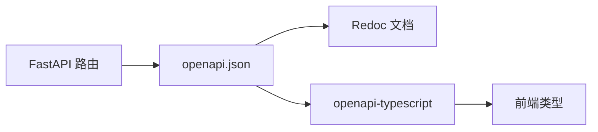

# OpenAPI 契约检查

确保前端调用、后端实现与 OpenAPI spec 三者一致，避免接口漂移导致集成故障。

## 单一事实源（SSOT）

MimirQ 的 API 契约以 OpenAPI spec 为权威来源：

| 层级 | 来源 | 说明 |
|------|------|------|
| 定义 | `openapi.json` / Redoc | 权威契约 |
| 后端 | FastAPI 自动生成 | 路由装饰器 → spec |
| 前端 | `web/types/openapi.ts` | openapi-typescript 生成 |



## 日常检查流程

### 后端变更后

```bash
# 1. 导出最新 spec
make openapi-export

# 2. 重新生成前端类型
pnpm gen:api-types

# 3. 检查类型是否有 breaking change
pnpm typecheck
```

:::warning Breaking Change
路径重命名、必填字段新增、响应结构变更均属于 breaking change。变更前需通知所有集成方，建议在 CI 中加入契约检查。
:::

### CI 集成

在 CI 管道中自动检查契约一致性：

1. **Spec 导出** — 确保提交的 `openapi.json` 与代码一致
2. **类型生成** — 确保前端类型与 spec 同步
3. **Breaking Change 检测** — 对比 main 分支的 spec，发现不兼容变更时阻断合并

```bash
# 示例: 检查 spec 是否已更新
make openapi-export
git diff --exit-code openapi.json || echo "OpenAPI spec 需要更新"
```

## FE/BE 对照矩阵

自动生成的对照矩阵展示前端路由与后端 API 的映射关系：

- [FE/BE 对照矩阵](../generated/fe-be-matrix.mdx)

:::info
修改 API 路径或前端路由后，需重新生成矩阵并提交。
:::

## 常见契约不一致问题

| 问题 | 表现 | 解决方案 |
|------|------|----------|
| 字段名不一致 | 422（snake_case vs camelCase） | 以 spec 为准，统一前端类型生成 |
| 必填字段新增 | 旧客户端 422 | 版本化或渐进式迁移 |
| 响应字段移除 | 前端 undefined | 前端做可选处理或同步更新 |
| 路径变更 | 404 | 保留旧路径重定向或通知集成方 |

## 手动对照检查清单

- [ ] 请求 Content-Type 与 spec 一致（JSON / multipart）
- [ ] 路径参数、查询参数名称与 spec 一致
- [ ] 请求体字段名遵循 spec 的命名约定（蛇形/驼峰）
- [ ] 响应结构与 spec 中的 schema 一致
- [ ] 错误响应格式与 `ErrorResponse` schema 一致

## 相关链接

- [Redoc — API 完整参考](https://skygazer42.github.io/MimirQ/)
- [FE/BE 对照矩阵](../generated/fe-be-matrix.mdx)
- [错误码与响应体](./errors-4xx-5xx.md)
