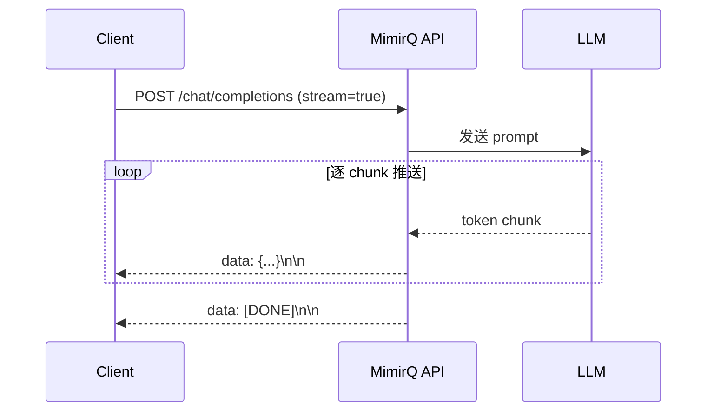

# SSE 流式对话

MimirQ 的对话接口支持 Server-Sent Events（SSE）流式输出，实现逐字输出的交互体验。

## 基本概念

SSE（Server-Sent Events）是基于 HTTP 的单向流式协议，服务端通过 `text/event-stream` 格式向客户端推送事件。



## curl 示例

```bash
curl -N "$BASE_URL/api/v1/chat/completions" \
  -H "Authorization: Bearer $TOKEN" \
  -H "Content-Type: application/json" \
  -d '{
    "messages": [{"role": "user", "content": "什么是 RAG?"}],
    "dataset_ids": ["'"$DATASET_ID"'"],
    "stream": true
  }'
```

`-N` 参数禁用 curl 的输出缓冲，以便实时看到 chunk。

## 客户端实现

### JavaScript EventSource

```javascript
const response = await fetch(`${BASE_URL}/api/v1/chat/completions`, {
  method: 'POST',
  headers: {
    'Authorization': `Bearer ${token}`,
    'Content-Type': 'application/json',
  },
  body: JSON.stringify({
    messages: [{ role: 'user', content: query }],
    dataset_ids: [datasetId],
    stream: true,
  }),
  signal: abortController.signal, // 支持取消
});

const reader = response.body.getReader();
const decoder = new TextDecoder();

while (true) {
  const { done, value } = await reader.read();
  if (done) break;
  const chunk = decoder.decode(value);
  // 解析 SSE data 行
}
```

:::tip AbortController
**必须**实现 AbortController 取消机制。用户切换页面或取消发送时，及时关闭连接，避免幽灵流式占用服务端资源。
:::

### 重连策略

| 策略 | 说明 |
|------|------|
| 自动重连 | 记录 last event id（如服务端支持），重连时发送 `Last-Event-ID` |
| 新建会话 | 服务端不支持断点续传时，创建新对话并重新发送 |
| 退避间隔 | 首次 1s，逐步增加到 30s，避免重连风暴 |

## 代理层配置

:::danger 必须禁用缓冲
反向代理如果启用了响应缓冲，会导致所有 chunk 在流式结束后才一次性发送到客户端，表现为"半天不出字，然后一次全出来"。
:::

**Nginx 配置**：

```nginx
location /api/v1/chat/ {
    proxy_buffering off;
    proxy_cache off;
    proxy_read_timeout 300s;
}
```

**常见代理配置要点**：

| 代理 | 关键配置 |
|------|----------|
| Nginx | `proxy_buffering off` |
| CloudFlare | 禁用 Auto Minify、启用 HTTP/2 |
| AWS ALB | 默认支持 SSE，注意超时设置 |

## 排障

| 现象 | 原因 | 解决方案 |
|------|------|----------|
| 长时间无 chunk | 代理缓冲未关闭 | 检查 Nginx/代理配置 |
| 断线后收到重复内容 | 重连未处理 offset | 实现 last event id 或幂等重连 |
| 连接被提前关闭 | 代理超时设置过短 | 增加 `proxy_read_timeout` |
| 页面切换后仍有请求 | 未实现取消机制 | 添加 AbortController |

## 相关链接

- [Redoc — API 完整参考](https://skygazer42.github.io/MimirQ/)
- [场景: SSE 重连](../scenarios/s15-sse-reconnect.md)
- [场景: 上传后对话](../scenarios/s01-upload-chat.md)
- [重试与幂等](./idempotency-retries.md)
