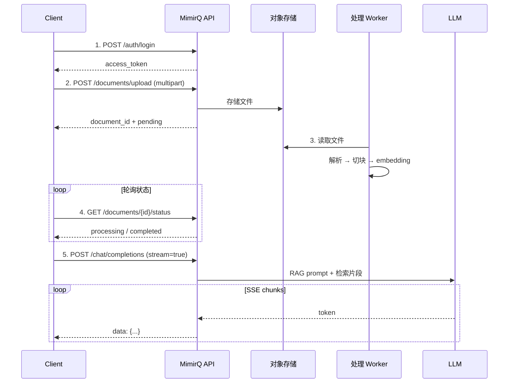

# 场景: 上传文档并对话

最小端到端路径：登录 → 上传文档 → 等待处理完成 → 发起 RAG 对话。

## 场景描述

验证从文档上传到 RAG 对话的完整链路，确认用户上传的内容能被正确检索和引用。

## API 调用时序



## curl 示例

```bash
# 1. 登录
TOKEN=$(curl -s -X POST "$BASE_URL/api/v1/auth/login" \
  -H "Content-Type: application/json" \
  -d '{"username": "user@example.com", "password": "pass"}' | jq -r '.access_token')

# 2. 上传文档
DOC_ID=$(curl -s -X POST "$BASE_URL/api/v1/documents/upload" \
  -H "Authorization: Bearer $TOKEN" \
  -F "file=@knowledge.pdf" \
  -F "dataset_id=$DATASET_ID" | jq -r '.id')

# 3. 轮询状态
while true; do
  STATUS=$(curl -s "$BASE_URL/api/v1/documents/$DOC_ID/status" \
    -H "Authorization: Bearer $TOKEN" | jq -r '.status')
  echo "Status: $STATUS"
  [ "$STATUS" = "completed" ] && break
  sleep 5
done

# 4. 发起对话
curl -N "$BASE_URL/api/v1/chat/completions" \
  -H "Authorization: Bearer $TOKEN" \
  -H "Content-Type: application/json" \
  -d '{
    "messages": [{"role": "user", "content": "文档中提到了什么？"}],
    "dataset_ids": ["'"$DATASET_ID"'"],
    "stream": true
  }'
```

## 预期结果

| 步骤 | 预期 |
|------|------|
| 上传 | 返回 `document_id`，状态为 `pending` |
| 处理 | 状态经 `processing` 最终变为 `completed` |
| 对话 | 回答内容引用了上传文档的信息 |

## 排障

| 问题 | 参考 |
|------|------|
| 上传 415/400 | [文件上传](../patterns/multipart-upload.md) |
| 文档一直 processing | [文档卡住排障](../tasks/document-stuck.md) |
| 对话无相关回答 | [知识库问答](../tasks/knowledge-base-qa.md) |
| 流式无输出 | [SSE 流式](../patterns/sse-streaming.md) |

## 相关链接

- [Redoc — API 完整参考](https://skygazer42.github.io/MimirQ/)
- [场景: 数据集绑定 RAG](./s02-dataset-rag.md)
