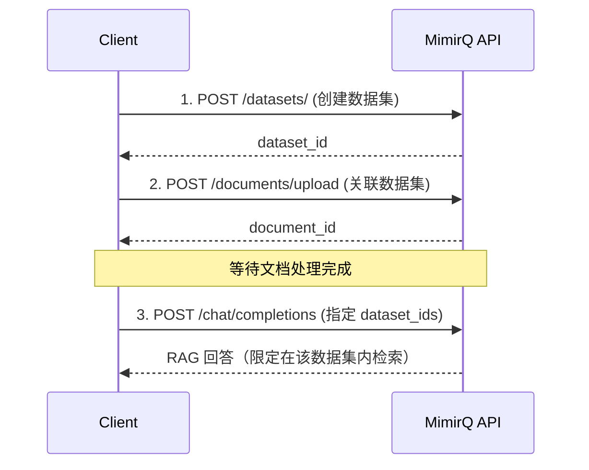

# 场景: 创建数据集进行 RAG

创建数据集、关联文档、在对话中指定数据集上下文进行定向检索。

## 场景描述

当需要将文档按业务域分组并在对话中精准检索特定知识集合时，需要创建数据集并绑定文档。

## API 调用时序



## curl 示例

```bash
# 1. 创建数据集
DATASET_ID=$(curl -s -X POST "$BASE_URL/api/v1/datasets/" \
  -H "Authorization: Bearer $TOKEN" \
  -H "Content-Type: application/json" \
  -d '{"name": "product-faq", "description": "产品 FAQ 知识库"}' | jq -r '.id')

# 2. 上传文档到该数据集
curl -X POST "$BASE_URL/api/v1/documents/upload" \
  -H "Authorization: Bearer $TOKEN" \
  -F "file=@faq.pdf" \
  -F "dataset_id=$DATASET_ID"

# 3. 指定数据集发起对话
curl -X POST "$BASE_URL/api/v1/chat/completions" \
  -H "Authorization: Bearer $TOKEN" \
  -H "Content-Type: application/json" \
  -d '{
    "messages": [{"role": "user", "content": "退款政策是什么？"}],
    "dataset_ids": ["'"$DATASET_ID"'"],
    "stream": false
  }'
```

## 预期结果

| 步骤 | 预期 |
|------|------|
| 创建数据集 | 返回 `dataset_id`，可在列表中查到 |
| 绑定文档 | 文档 `dataset_id` 字段指向目标数据集 |
| 定向检索 | 对话仅检索指定数据集内的文档 |

## 排障

| 问题 | 可能原因 |
|------|----------|
| 对话返回无关内容 | `dataset_ids` 参数未正确传递 |
| 数据集为空 | 文档尚未处理完成或关联错误 |
| 422 创建失败 | 缺少必填字段，对照 Redoc 检查 |

## 相关链接

- [Redoc — API 完整参考](https://skygazer42.github.io/MimirQ/)
- [场景: 上传后对话](./s01-upload-chat.md) | [分页模式](../patterns/pagination.md)
