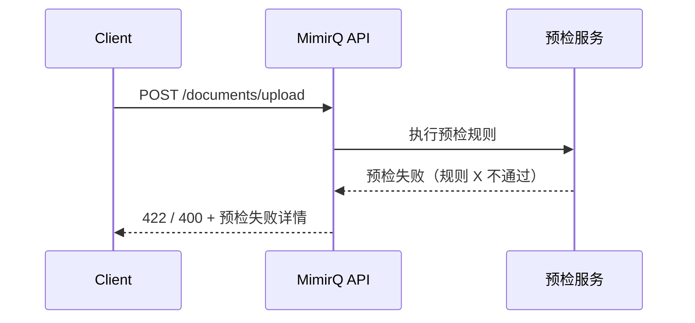

# 场景: 预检阻断

文档上传或操作被预检规则拦截时的 API 反馈与处理流程。

## 场景描述

MimirQ 支持在文档入库前执行预检（precheck），如格式校验、大小限制、敏感内容扫描等。预检失败时操作被阻断，客户端需正确处理拦截信息。

## API 调用时序



## curl 示例

```bash
# 上传被预检拦截的文档
curl -s -X POST "$BASE_URL/api/v1/documents/upload" \
  -H "Authorization: Bearer $TOKEN" \
  -F "file=@oversized-file.pdf" \
  -F "dataset_id=$DATASET_ID" | jq .

# 典型拦截响应
# {
#   "detail": "Precheck failed: file size exceeds limit",
#   "code": "PRECHECK_FAILED",
#   "checks": [{"rule": "max_file_size", "passed": false}]
# }
```

## 预期结果

| 场景 | 预期响应 |
|------|----------|
| 格式不支持 | 415 + 不支持的 MIME 类型 |
| 文件过大 | 400/422 + 超出大小限制 |
| 预检规则不通过 | 422 + 具体规则与失败原因 |
| 全部通过 | 正常上传流程继续 |

## 客户端处理建议

- 解析错误响应中的 `checks` 数组（如有），向用户展示具体哪些规则未通过
- 区分"可修复"（换小文件）与"需管理员调整"（规则配置）的拦截
- 不要盲目重试被预检拦截的请求

## 排障

| 问题 | 可能原因 |
|------|----------|
| 正常文件被拦截 | 预检规则过严，联系管理员调整 |
| 预检响应不包含详情 | 接口版本差异，对照 Redoc 确认 |

## 相关链接

- [Redoc — API 完整参考](https://skygazer42.github.io/MimirQ/)
- [文件上传](../patterns/multipart-upload.md) | [错误码](../patterns/errors-4xx-5xx.md)
