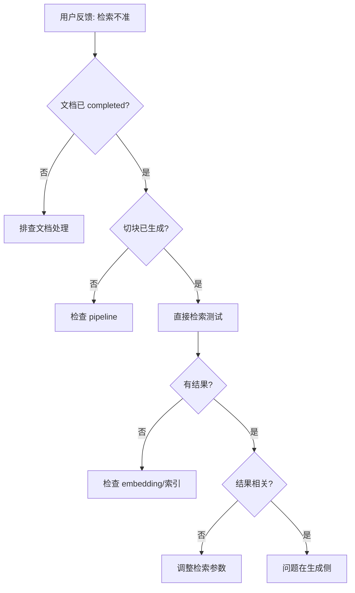

# 场景: 检索调试

当 RAG 对话未命中预期内容时，通过检索调试接口定位问题。

## 场景描述

用户反馈"问了但没有答案"或"答案不相关"时，需要逐步排查：文档是否已索引、检索是否命中、重排是否过滤。

## 调试流程



## curl 示例

```bash
# 1. 确认文档状态与切块数
curl -s "$BASE_URL/api/v1/documents/$DOCUMENT_ID" \
  -H "Authorization: Bearer $TOKEN" | jq '{status, chunks_count}'

# 2. 直接检索测试
curl -s -X POST "$BASE_URL/api/v1/retrieval/search" \
  -H "Authorization: Bearer $TOKEN" \
  -H "Content-Type: application/json" \
  -d '{
    "query": "目标关键词",
    "dataset_ids": ["'"$DATASET_ID"'"],
    "top_k": 10
  }' | jq '.results[] | {score, content: .content[:100]}'

# 3. 查看切块列表（如接口支持）
curl -s "$BASE_URL/api/v1/documents/$DOCUMENT_ID/chunks?limit=5" \
  -H "Authorization: Bearer $TOKEN" | jq '.items[] | {id, content: .content[:80]}'
```

## 调试检查清单

| 检查项 | 正常标准 | 异常处理 |
|--------|----------|----------|
| 文档状态 | `completed` | 转 [文档卡住排障](../tasks/document-stuck.md) |
| 切块数量 | > 0 | 检查 pipeline 配置 |
| 检索结果 | 有相关片段 | 检查 embedding 模型与索引 |
| 检索分数 | 合理阈值以上 | 调整 `top_k` 或分数阈值 |

## 预期结果

| 步骤 | 预期 |
|------|------|
| 检索测试 | 返回与查询相关的文档片段及相似度分数 |
| 切块列表 | 能看到文档被切分后的内容片段 |

## 排障

| 问题 | 可能原因 |
|------|----------|
| 检索始终空结果 | embedding 索引未构建或模型不匹配 |
| 分数极低 | 查询与文档语义距离大，或 embedding 模型选择不当 |
| 切块内容异常 | 解析或切块配置问题 |

## 相关链接

- [Redoc — API 完整参考](https://skygazer42.github.io/MimirQ/)
- [知识库问答](../tasks/knowledge-base-qa.md) | [可观测性](../patterns/observability-requests.md)
