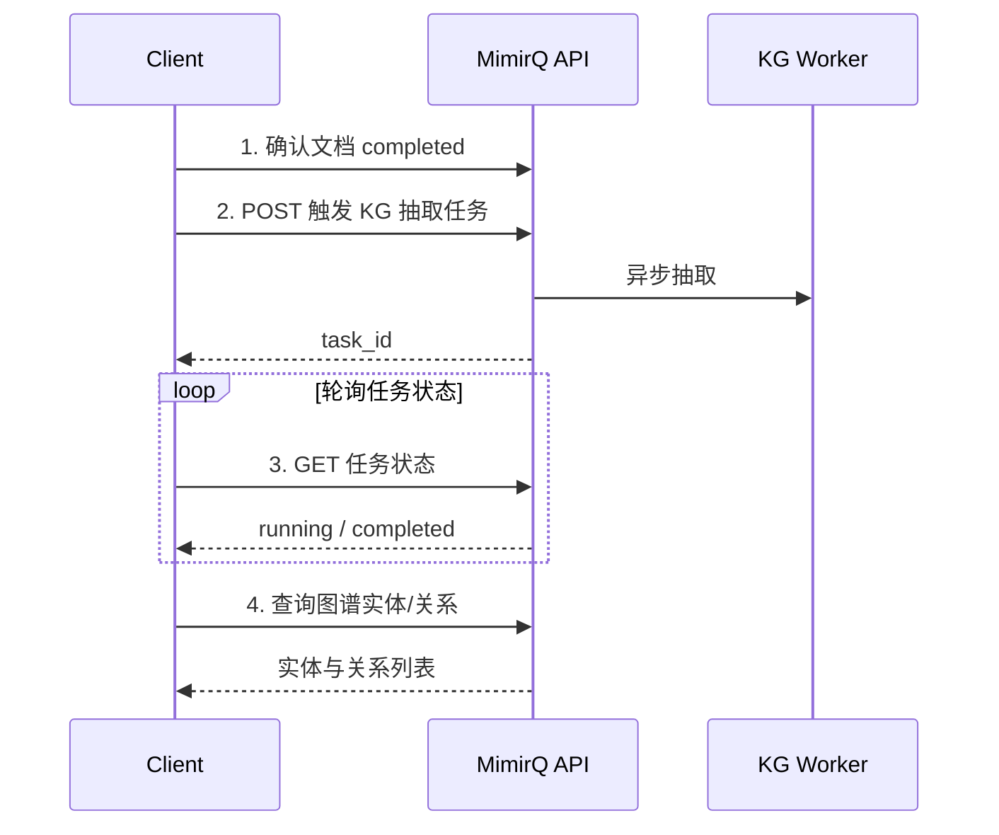

# 场景: 触发知识图谱抽取

在文档处理完成后触发知识图谱（KG）实体与关系抽取，并在对话中利用图谱信息增强检索。

## 场景描述

MimirQ 支持从文档中抽取实体与关系构建知识图谱，KG 抽取是异步任务，需在文档处理完成后触发。

## API 调用时序



## curl 示例

```bash
# 1. 确认文档已处理完成
curl -s "$BASE_URL/api/v1/documents/$DOCUMENT_ID/status" \
  -H "Authorization: Bearer $TOKEN" | jq '.status'

# 2. 触发 KG 抽取（路径以 OpenAPI 为准）
curl -X POST "$BASE_URL/api/v1/kg/extract" \
  -H "Authorization: Bearer $TOKEN" \
  -H "Content-Type: application/json" \
  -d '{"document_ids": ["'"$DOCUMENT_ID"'"]}'

# 3. 查询抽取结果
curl -s "$BASE_URL/api/v1/kg/entities?document_id=$DOCUMENT_ID" \
  -H "Authorization: Bearer $TOKEN" | jq '.items[:3]'
```

:::warning 先后顺序
KG 抽取**必须在文档处理完成后**触发。对 `processing` 状态的文档触发抽取会失败或产生不完整结果。
:::

## 预期结果

| 步骤 | 预期 |
|------|------|
| 触发抽取 | 返回任务 ID，状态为 `running` |
| 抽取完成 | 任务状态变为 `completed` |
| 图谱查询 | 能查到文档中的实体与关系 |

## 排障

| 问题 | 可能原因 |
|------|----------|
| 抽取任务长期 running | KG Worker 负载高或依赖 LLM 服务不可用 |
| 实体为空 | 文档内容过短或抽取模型不匹配 |
| 抽取失败 | 文档未完成处理或权限不足 |

## 相关链接

- [Redoc — API 完整参考](https://skygazer42.github.io/MimirQ/)
- [场景: 上传后对话](./s01-upload-chat.md) | [文档卡住排障](../tasks/document-stuck.md)
