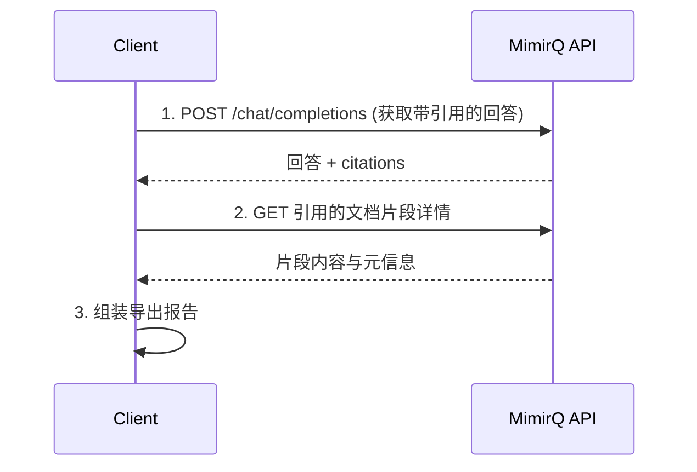

# 场景: 证据导出

将 RAG 对话中的检索证据（citation / source）导出为报告，用于合规审计或知识溯源。

## 场景描述

在知识问答场景中，回答的每个论据需要溯源到具体文档片段。证据导出功能将这些引用关系提取并格式化输出。

## API 调用时序



## curl 示例

```bash
# 1. 发起对话并获取引用
RESPONSE=$(curl -s -X POST "$BASE_URL/api/v1/chat/completions" \
  -H "Authorization: Bearer $TOKEN" \
  -H "Content-Type: application/json" \
  -d '{
    "messages": [{"role": "user", "content": "公司的数据安全政策是什么？"}],
    "dataset_ids": ["'"$DATASET_ID"'"],
    "stream": false
  }')

echo "$RESPONSE" | jq '.citations'

# 2. 获取引用片段的详细信息
CHUNK_ID=$(echo "$RESPONSE" | jq -r '.citations[0].chunk_id')
curl -s "$BASE_URL/api/v1/chunks/$CHUNK_ID" \
  -H "Authorization: Bearer $TOKEN" | jq '{content, document_id, metadata}'
```

## 预期结果

| 步骤 | 预期 |
|------|------|
| 对话响应 | 包含 `citations` 数组，引用到具体片段 |
| 片段详情 | 包含完整内容、来源文档 ID、元数据 |
| 导出报告 | 问题 + 回答 + 引用片段 + 来源文档 |

:::info
证据导出的具体 API 路径与响应字段以 [Redoc](https://skygazer42.github.io/MimirQ/) 中最新定义为准。
:::

## 排障

| 问题 | 可能原因 |
|------|----------|
| citations 为空 | 检索未命中或回答未启用引用功能 |
| 片段 ID 404 | 片段已被重新切块或删除 |

## 相关链接

- [Redoc — API 完整参考](https://skygazer42.github.io/MimirQ/)
- [场景: 检索调试](./s04-retrieval-debug.md) | [知识库问答](../tasks/knowledge-base-qa.md)
