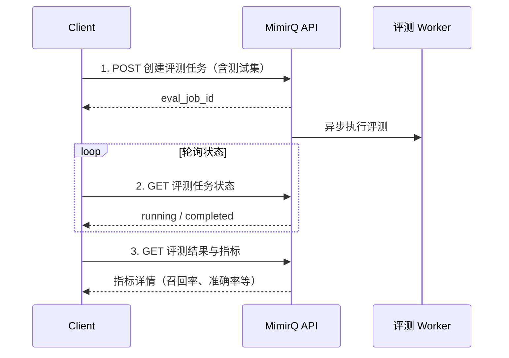

# 场景: 评测任务

创建 RAG 评测任务，拉取检索与生成质量指标，设置回归门槛。

## 场景描述

通过标准化的评测任务衡量 RAG 系统的检索准确率、回答质量等指标，并在 CI 或版本迭代中用作回归基准。

## API 调用时序



## curl 示例

```bash
# 1. 创建评测任务
EVAL_ID=$(curl -s -X POST "$BASE_URL/api/v1/eval/jobs" \
  -H "Authorization: Bearer $TOKEN" \
  -H "Content-Type: application/json" \
  -d '{
    "name": "v1.2-regression",
    "dataset_ids": ["'"$DATASET_ID"'"],
    "test_cases": [
      {"query": "退款政策", "expected_answer": "7天无理由退款"}
    ]
  }' | jq -r '.id')

# 2. 查询评测状态
curl -s "$BASE_URL/api/v1/eval/jobs/$EVAL_ID" \
  -H "Authorization: Bearer $TOKEN" | jq '{status, progress}'

# 3. 获取评测结果
curl -s "$BASE_URL/api/v1/eval/jobs/$EVAL_ID/results" \
  -H "Authorization: Bearer $TOKEN" | jq '.metrics'
```

## 预期结果

| 步骤 | 预期 |
|------|------|
| 创建任务 | 返回 `eval_job_id`，状态为 `pending` |
| 执行完成 | 每条测试用例有独立评分 |
| 指标汇总 | 包含整体召回率、准确率、平均延迟等 |

## 回归门槛示例

```bash
# CI 中判断评测是否通过
RECALL=$(curl -s "$BASE_URL/api/v1/eval/jobs/$EVAL_ID/results" \
  -H "Authorization: Bearer $TOKEN" | jq '.metrics.recall')

if (( $(echo "$RECALL < 0.8" | bc -l) )); then
  echo "FAIL: Recall $RECALL < 0.8 threshold"
  exit 1
fi
```

## 排障

| 问题 | 可能原因 |
|------|----------|
| 评测任务超时 | 测试用例过多或 LLM 服务慢 |
| 指标异常低 | 检索配置变更或索引未更新 |

## 相关链接

- [Redoc — API 完整参考](https://skygazer42.github.io/MimirQ/)
- [场景: 检索调试](./s04-retrieval-debug.md) | [场景: 反馈闭环](./s08-feedback-loop.md)
