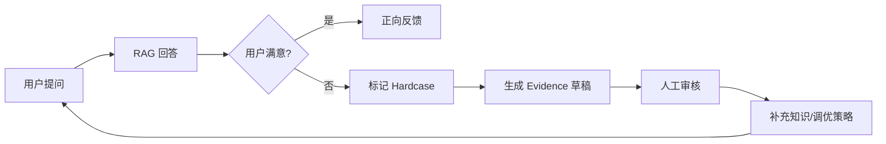

# 场景: 反馈闭环

用户对 RAG 回答标记 hardcase 后，形成证据草稿并反哺到知识库优化。

## 场景描述

当用户对回答不满意时，通过反馈机制收集 hardcase（难例），生成证据草稿，驱动知识库内容补充或检索策略调优。

## 反馈闭环流程



## curl 示例

```bash
# 1. 提交负向反馈（标记 hardcase）
curl -X POST "$BASE_URL/api/v1/feedback" \
  -H "Authorization: Bearer $TOKEN" \
  -H "Content-Type: application/json" \
  -d '{
    "message_id": "'"$MESSAGE_ID"'",
    "rating": "negative",
    "comment": "回答与问题无关，未引用正确文档"
  }'

# 2. 查看 hardcase 列表
curl -s "$BASE_URL/api/v1/feedback/hardcases?limit=10" \
  -H "Authorization: Bearer $TOKEN" | jq '.items[] | {message_id, comment}'

# 3. 生成 evidence 草稿（如接口支持）
curl -X POST "$BASE_URL/api/v1/evidence/draft" \
  -H "Authorization: Bearer $TOKEN" \
  -H "Content-Type: application/json" \
  -d '{"hardcase_ids": ["'"$HARDCASE_ID"'"]}'
```

## 预期结果

| 步骤 | 预期 |
|------|------|
| 提交反馈 | 反馈记录关联到对话消息 |
| Hardcase 列表 | 可按时间/数据集筛选负向反馈 |
| Evidence 草稿 | 包含问题、错误回答、建议修正方向 |

## 闭环最佳实践

- 定期审查 hardcase 列表，识别高频问题模式
- 将 hardcase 转化为评测用例（参见 [评测任务](./s07-eval-job.md)）
- 根据反馈补充文档或调整检索参数后，重新运行评测验证改善

## 排障

| 问题 | 可能原因 |
|------|----------|
| 反馈未关联消息 | `message_id` 不正确或会话已过期 |
| Hardcase 列表为空 | 反馈接口未启用或权限不足 |

## 相关链接

- [Redoc — API 完整参考](https://skygazer42.github.io/MimirQ/)
- [场景: 评测任务](./s07-eval-job.md) | [场景: 证据导出](./s06-evidence-export.md)
