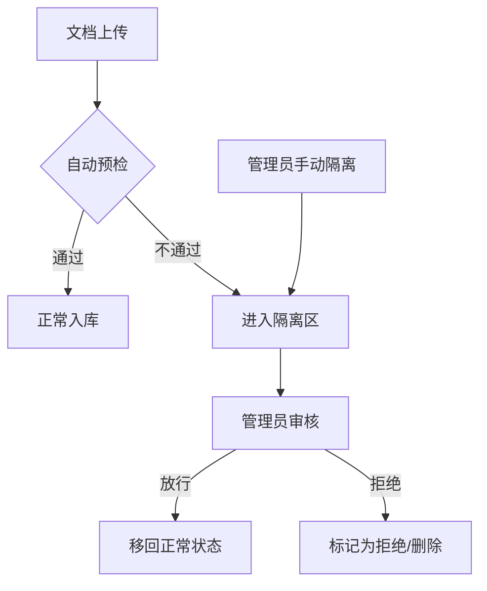

# 场景: 治理与隔离

文档进入隔离区后的审批流程，以及通过 API 操作隔离区的方法。

## 场景描述

当文档因预检规则、内容审核或管理员操作被移入隔离区（quarantine）时，需要通过审批流程决定放行或拒绝。

## 治理流程



## curl 示例

```bash
# 1. 查看隔离区文档列表
curl -s "$BASE_URL/api/v1/quarantine/documents?limit=20" \
  -H "Authorization: Bearer $TOKEN" | jq '.items[] | {id, reason, created_at}'

# 2. 审批放行
curl -X POST "$BASE_URL/api/v1/quarantine/documents/$DOCUMENT_ID/approve" \
  -H "Authorization: Bearer $TOKEN" \
  -H "Content-Type: application/json" \
  -d '{"comment": "内容已确认安全"}'

# 3. 审批拒绝
curl -X POST "$BASE_URL/api/v1/quarantine/documents/$DOCUMENT_ID/reject" \
  -H "Authorization: Bearer $TOKEN" \
  -H "Content-Type: application/json" \
  -d '{"comment": "包含敏感信息，不予入库"}'
```

## 预期结果

| 步骤 | 预期 |
|------|------|
| 隔离列表 | 显示被隔离文档及原因 |
| 放行 | 文档恢复正常处理流程 |
| 拒绝 | 文档标记为拒绝，不进入索引 |

## 治理最佳实践

- 配置预检规则覆盖敏感内容、格式、大小等维度
- 定期清理隔离区，避免积压
- 审批操作记录审计日志，便于合规追溯

:::info
隔离区相关 API 路径以 [Redoc](https://skygazer42.github.io/MimirQ/) 中实际定义为准，上述路径仅为示意。
:::

## 排障

| 问题 | 可能原因 |
|------|----------|
| 放行后文档仍未处理 | 处理队列积压，参见 [文档卡住排障](../tasks/document-stuck.md) |
| 无法操作隔离区 | 需要管理员权限 |

## 相关链接

- [Redoc — API 完整参考](https://skygazer42.github.io/MimirQ/)
- [场景: 预检拦截](./s03-precheck-block.md) | [管理员角色](../roles/admin.md)
