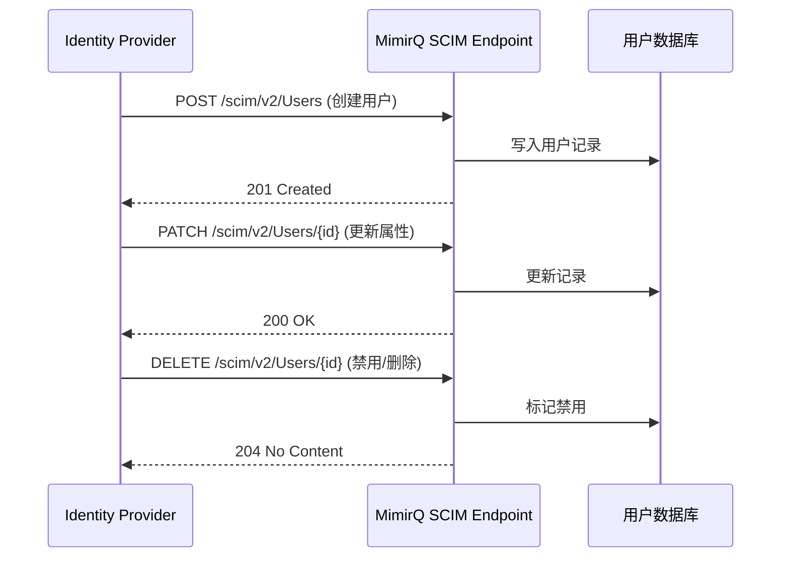

# 场景: SCIM 用户同步

通过 SCIM 协议将 IdP（Identity Provider）中的用户与组同步到 MimirQ 租户。

## 场景描述

企业部署中，用户身份通常由统一的 IdP（如 Azure AD、Okta）管理。通过 SCIM 协议自动同步用户创建、更新与禁用，避免手动维护。

## 同步流程



## 配置要点

| 配置项 | 说明 |
|--------|------|
| SCIM Endpoint | `{BASE_URL}/scim/v2/` |
| 认证方式 | Bearer Token（管理员级别） |
| 用户属性映射 | `userName` → 登录名，`emails` → 邮箱 |
| 组映射 | SCIM Groups → MimirQ 角色/租户 |

:::info
SCIM 端点是否启用以及具体路径以部署配置与 [Redoc](https://skygazer42.github.io/MimirQ/) 为准。
:::

## curl 示例

```bash
# 创建用户
curl -X POST "$BASE_URL/scim/v2/Users" \
  -H "Authorization: Bearer $SCIM_TOKEN" \
  -H "Content-Type: application/scim+json" \
  -d '{
    "schemas": ["urn:ietf:params:scim:schemas:core:2.0:User"],
    "userName": "john.doe@company.com",
    "name": {"givenName": "John", "familyName": "Doe"},
    "emails": [{"value": "john.doe@company.com", "primary": true}],
    "active": true
  }'

# 查询已同步用户
curl -s "$BASE_URL/scim/v2/Users?filter=userName eq \"john.doe@company.com\"" \
  -H "Authorization: Bearer $SCIM_TOKEN" | jq '.Resources'
```

## 预期结果

| 操作 | 预期 |
|------|------|
| 创建用户 | MimirQ 中出现对应用户，可登录 |
| 更新属性 | 用户信息同步更新 |
| 禁用用户 | 用户无法登录但数据保留 |

## 注意事项

- SCIM 同步为**最终一致**，IdP 侧修改后同步到 MimirQ 可能有延迟
- 删除用户时建议使用**禁用**（`active: false`）而非硬删除，保留审计数据
- 组映射配置影响用户在 MimirQ 中的角色与租户归属

## 排障

| 问题 | 可能原因 |
|------|----------|
| 同步失败 401 | SCIM Token 无效或过期 |
| 用户未出现 | 属性映射不正确或 filter 条件不匹配 |
| 角色不正确 | 组映射配置与 IdP 组名不一致 |

## 相关链接

- [Redoc — API 完整参考](https://skygazer42.github.io/MimirQ/)
- [认证模式](../patterns/auth-modes.md) | [管理员角色](../roles/admin.md)
