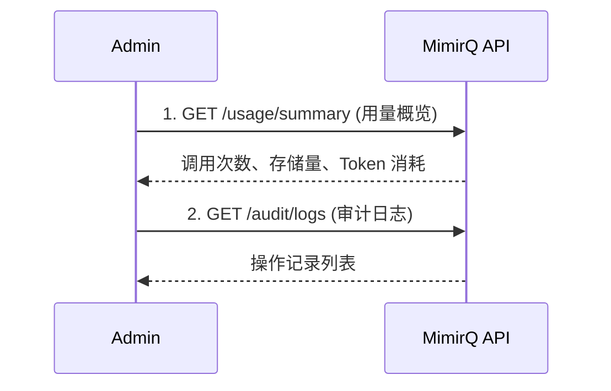

# 场景: 用量审计

查询 API 调用用量与审计日志，用于计费对账与合规审查。

## 场景描述

管理员或运维需要了解各租户/用户的 API 调用量、存储用量以及关键操作的审计记录。

## 调用时序



## curl 示例

```bash
# 1. 查询用量概览
curl -s "$BASE_URL/api/v1/usage/summary?period=monthly" \
  -H "Authorization: Bearer $TOKEN" | jq .

# 2. 查询审计日志
curl -s "$BASE_URL/api/v1/audit/logs?limit=20&sort_by=created_at&order=desc" \
  -H "Authorization: Bearer $TOKEN" | jq '.items[] | {action, user_id, resource, created_at}'

# 3. 按用户筛选审计
curl -s "$BASE_URL/api/v1/audit/logs?user_id=$USER_ID&limit=50" \
  -H "Authorization: Bearer $TOKEN" | jq '.items'
```

## 预期结果

| 查询 | 预期内容 |
|------|----------|
| 用量概览 | API 调用次数、文档存储量、LLM Token 消耗 |
| 审计日志 | 操作类型、操作者、目标资源、时间戳 |

## 审计日志关键字段

| 字段 | 说明 |
|------|------|
| `action` | 操作类型（create / update / delete / login） |
| `user_id` | 操作者 |
| `resource_type` | 目标资源类型 |
| `resource_id` | 目标资源 ID |
| `created_at` | 操作时间 |
| `metadata` | 操作详情（如变更前后值） |

## 对账建议

- 定期导出用量数据，与内部计费系统对账
- 审计日志保留期限以部署配置为准，过期前做好归档
- 关注异常用量峰值（如单用户短时间大量上传）

:::info
用量与审计 API 的具体路径以 [Redoc](https://skygazer42.github.io/MimirQ/) 中实际定义为准。
:::

## 排障

| 问题 | 可能原因 |
|------|----------|
| 用量数据不准确 | 统计延迟或缓存未刷新 |
| 审计日志缺失 | 部分操作未配置审计或日志保留过期 |

## 相关链接

- [Redoc — API 完整参考](https://skygazer42.github.io/MimirQ/)
- [管理员角色](../roles/admin.md) | [可观测性](../patterns/observability-requests.md)
