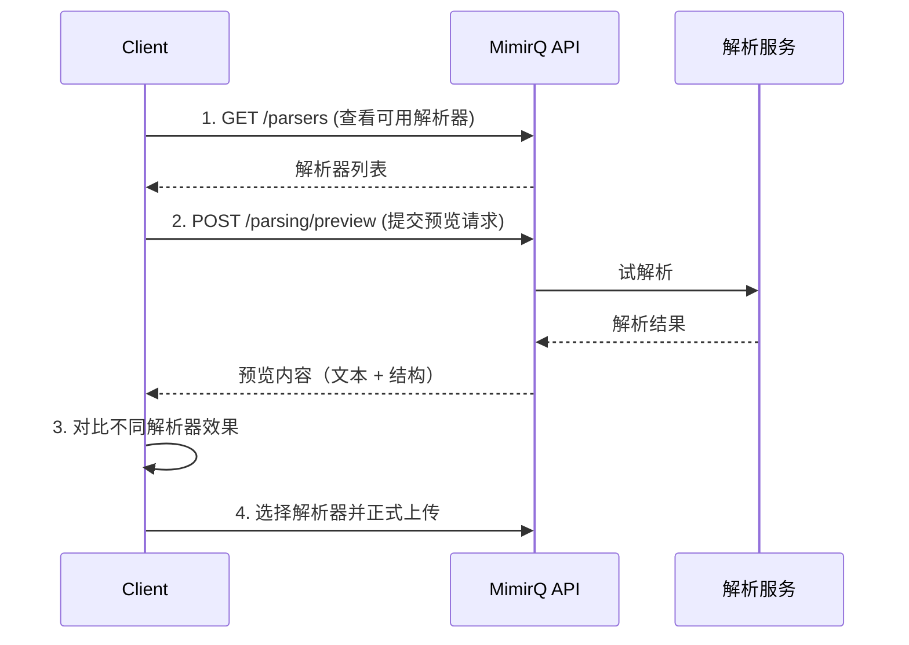

# 场景: 解析工作台

在文档正式入库前，使用解析工作台预览解析效果并选择最优解析器。

## 场景描述

不同文档格式和解析器组合会产生不同的解析效果。解析工作台允许在正式入库前测试解析质量，选择最适合当前文档的解析器配置。

## 调用时序



## curl 示例

```bash
# 1. 查看可用解析器
curl -s "$BASE_URL/api/v1/parsers" \
  -H "Authorization: Bearer $TOKEN" | jq '.[] | {id, name, supported_formats}'

# 2. 提交解析预览
curl -s -X POST "$BASE_URL/api/v1/parsing/preview" \
  -H "Authorization: Bearer $TOKEN" \
  -F "file=@document.pdf" \
  -F "parser_id=$PARSER_ID" | jq '{text_length: (.text | length), sections: (.sections | length)}'

# 3. 换一个解析器对比
curl -s -X POST "$BASE_URL/api/v1/parsing/preview" \
  -H "Authorization: Bearer $TOKEN" \
  -F "file=@document.pdf" \
  -F "parser_id=$ALT_PARSER_ID" | jq '{text_length: (.text | length), sections: (.sections | length)}'
```

## 预期结果

| 步骤 | 预期 |
|------|------|
| 解析器列表 | 返回可用解析器及其支持的格式 |
| 预览结果 | 包含提取的文本、章节结构、元数据 |
| 对比效果 | 不同解析器在文本完整度和结构识别上的差异 |

## 选择建议

| 文档类型 | 推荐策略 |
|----------|----------|
| 标准 PDF | 默认解析器通常足够 |
| 扫描件 PDF | 需要 OCR 支持的解析器 |
| 复杂表格 | 选择表格识别能力强的解析器 |
| Office 文档 | 对照解析器的格式支持列表 |

:::info
解析工作台相关 API 路径以 [Redoc](https://skygazer42.github.io/MimirQ/) 中实际定义为准。
:::

## 排障

| 问题 | 可能原因 |
|------|----------|
| 预览超时 | 文件过大或解析器服务负载高 |
| 文本为空 | 扫描件未使用 OCR 解析器 |
| 乱码 | 文件编码不匹配 |

## 相关链接

- [Redoc — API 完整参考](https://skygazer42.github.io/MimirQ/)
- [场景: 管道预览](./s13-pipeline-preview.md) | [文件上传](../patterns/multipart-upload.md)
