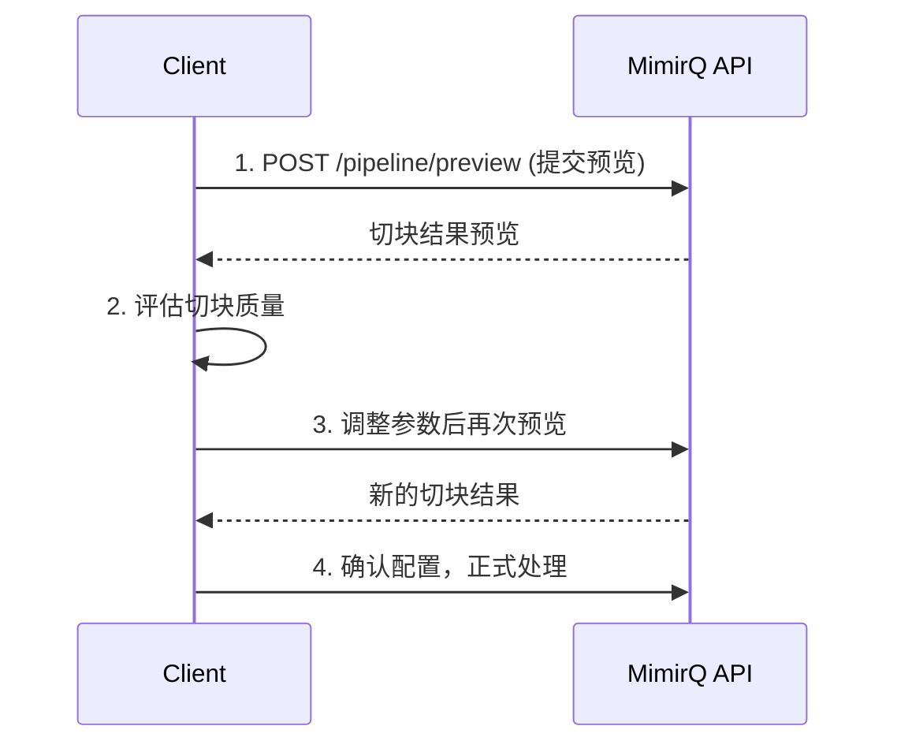

# 场景: Pipeline 预览

在文档正式落库前，预览切块与清洗效果，确认 Pipeline 配置符合预期。

## 场景描述

文档经过解析后需要经过切块（chunking）、清洗（cleaning）等 Pipeline 步骤。Pipeline 预览允许在不落库的情况下查看处理效果。

## 调用时序



## curl 示例

```bash
# 1. 提交 Pipeline 预览
curl -s -X POST "$BASE_URL/api/v1/pipeline/preview" \
  -H "Authorization: Bearer $TOKEN" \
  -H "Content-Type: application/json" \
  -d '{
    "document_id": "'"$DOCUMENT_ID"'",
    "chunk_size": 500,
    "chunk_overlap": 50,
    "cleaning_rules": ["remove_headers", "normalize_whitespace"]
  }' | jq '.chunks[:3] | .[] | {index: .index, length: (.content | length), content: .content[:100]}'

# 2. 调整切块大小后再次预览
curl -s -X POST "$BASE_URL/api/v1/pipeline/preview" \
  -H "Authorization: Bearer $TOKEN" \
  -H "Content-Type: application/json" \
  -d '{
    "document_id": "'"$DOCUMENT_ID"'",
    "chunk_size": 1000,
    "chunk_overlap": 100
  }' | jq '{total_chunks: (.chunks | length), avg_length: ([.chunks[].content | length] | add / length)}'
```

## 预期结果

| 步骤 | 预期 |
|------|------|
| 预览结果 | 返回切块列表，包含内容、长度、索引 |
| 参数调整 | 不同参数产生不同切块粒度 |
| 清洗效果 | 清洗规则正确移除了噪音内容 |

## 参数调优指南

| 参数 | 影响 | 建议范围 |
|------|------|----------|
| `chunk_size` | 切块大小 | 200-2000 token |
| `chunk_overlap` | 重叠区域 | chunk_size 的 10-20% |
| 清洗规则 | 噪音去除 | 按文档类型选择 |

:::tip 预览 vs 落库
预览不会写入索引，可以反复测试不同配置。确认效果满意后再正式处理文档。
:::

## 排障

| 问题 | 可能原因 |
|------|----------|
| 切块过碎 | `chunk_size` 过小 |
| 语义被截断 | `chunk_overlap` 不足 |
| 预览与落库结果不一致 | Pipeline 配置在预览后被修改 |

## 相关链接

- [Redoc — API 完整参考](https://skygazer42.github.io/MimirQ/)
- [场景: 解析工作台](./s12-parsing-workspace.md) | [文档卡住排障](../tasks/document-stuck.md)
