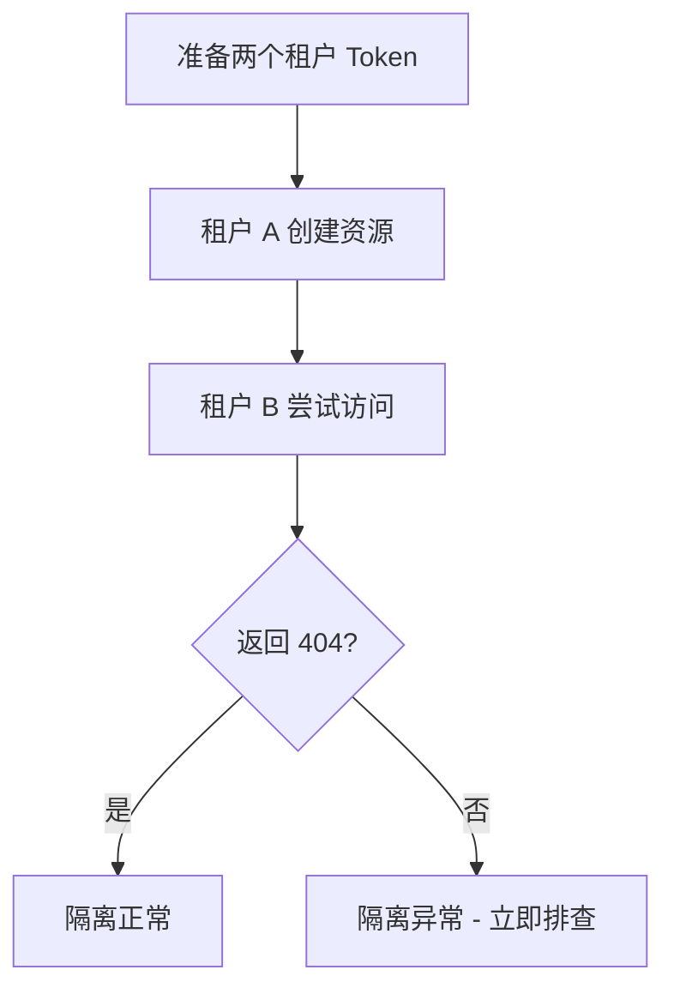

# 场景: 多租户隔离验证

验证 MimirQ 多租户部署中的数据隔离与权限边界。

## 场景描述

多租户部署中，不同租户的数据必须严格隔离。本场景提供系统化的验证方法，确保租户边界不可穿越。

## 验证矩阵



## 测试步骤

### Step 1 — 准备测试 Token

```bash
# 获取租户 A 的 Token
TOKEN_A=$(curl -s -X POST "$BASE_URL/api/v1/auth/login" \
  -H "Content-Type: application/json" \
  -d '{"username": "admin-a@tenant-a.com", "password": "pass-a"}' | jq -r '.access_token')

# 获取租户 B 的 Token
TOKEN_B=$(curl -s -X POST "$BASE_URL/api/v1/auth/login" \
  -H "Content-Type: application/json" \
  -d '{"username": "admin-b@tenant-b.com", "password": "pass-b"}' | jq -r '.access_token')
```

### Step 2 — 租户 A 创建资源

```bash
DATASET_A=$(curl -s -X POST "$BASE_URL/api/v1/datasets/" \
  -H "Authorization: Bearer $TOKEN_A" \
  -H "Content-Type: application/json" \
  -d '{"name": "tenant-a-private"}' | jq -r '.id')
```

### Step 3 — 租户 B 尝试访问

```bash
# 列表中不应出现租户 A 的数据集
curl -s "$BASE_URL/api/v1/datasets/" \
  -H "Authorization: Bearer $TOKEN_B" | jq '[.items[].id] | index("'"$DATASET_A"'")'
# 预期: null

# 直接访问应返回 404
HTTP_CODE=$(curl -s -o /dev/null -w "%{http_code}" \
  "$BASE_URL/api/v1/datasets/$DATASET_A" \
  -H "Authorization: Bearer $TOKEN_B")
echo "Expected 404, got: $HTTP_CODE"
```

## 验证检查清单

| 测试项 | 预期 | 验证方法 |
|--------|------|----------|
| 列表隔离 | 租户 B 列表不含 A 的资源 | GET 列表并检查 |
| 详情隔离 | 租户 B 访问 A 的资源返回 404 | GET 详情检查状态码 |
| 文档隔离 | 租户 B 无法下载 A 的文档 | GET 文档内容检查 |
| 检索隔离 | 租户 B 检索不到 A 的内容 | POST 检索检查结果 |
| 对话隔离 | 租户 B 的 RAG 不引用 A 的文档 | POST 对话检查引用 |

:::danger 发现隔离问题
如果任何测试项发现跨租户数据泄露，应**立即停止测试并上报安全团队**，排查中间件与 ACL 逻辑。
:::

## 排障

| 问题 | 可能原因 |
|------|----------|
| 跨租户可见 | JWT claims 中缺少 tenant_id |
| 角色权限异常 | 超级管理员角色可能跨租户 |

## 相关链接

- [Redoc — API 完整参考](https://skygazer42.github.io/MimirQ/)
- [租户 Header](../patterns/tenant-headers.md) | [认证模式](../patterns/auth-modes.md)
