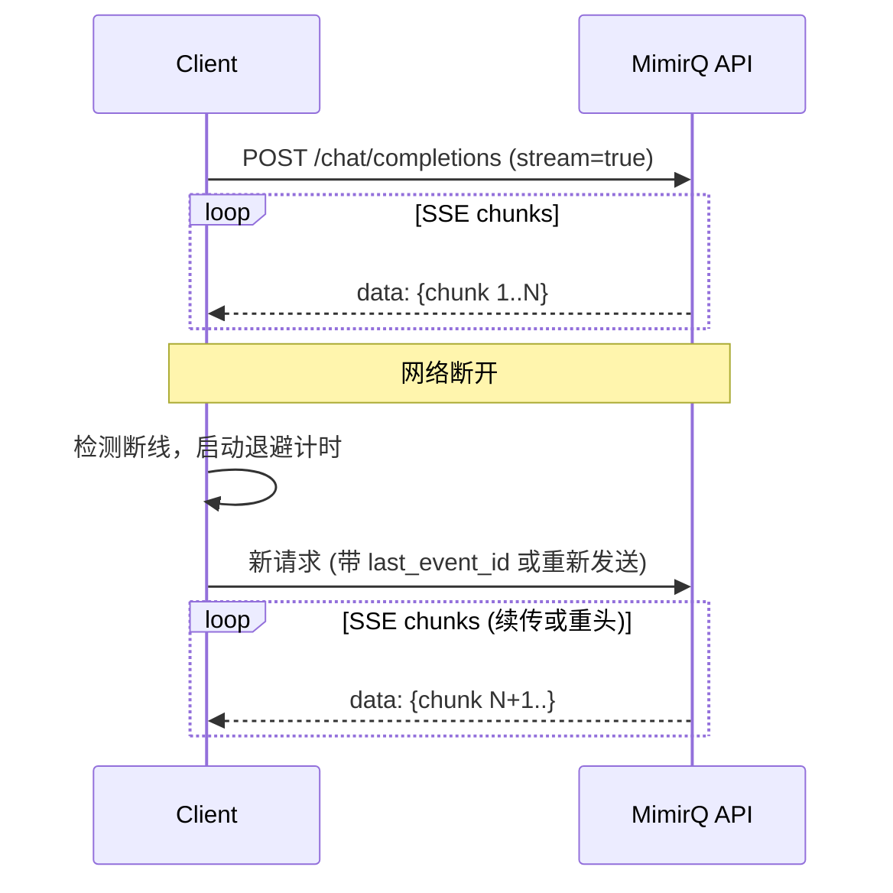

# 场景: SSE 断线重连

流式对话过程中网络断开后的重连策略与实现。

## 场景描述

SSE 流式对话容易受网络波动、代理超时等因素影响断开。客户端需要实现优雅的重连机制，避免用户体验中断。

## 断线重连时序



## 重连策略

### 策略 A: 带 Last-Event-ID 续传

如果服务端支持 `Last-Event-ID`，断线后可从断点续传：

```javascript
let lastEventId = null;

async function startStream(query) {
  const headers = {
    'Authorization': `Bearer ${token}`,
    'Content-Type': 'application/json',
  };
  if (lastEventId) {
    headers['Last-Event-ID'] = lastEventId;
  }

  const response = await fetch(`${BASE_URL}/api/v1/chat/completions`, {
    method: 'POST',
    headers,
    body: JSON.stringify({
      messages: [{ role: 'user', content: query }],
      stream: true,
    }),
  });

  const reader = response.body.getReader();
  // 解析 SSE，更新 lastEventId
}
```

### 策略 B: 重新发送请求

服务端不支持断点续传时，重新发起请求并合并结果：

```javascript
async function streamWithRetry(query, maxRetries = 3) {
  let accumulated = '';
  let retries = 0;

  while (retries < maxRetries) {
    try {
      const stream = await startStream(query);
      for await (const chunk of stream) {
        accumulated += chunk;
        onChunk(chunk);
      }
      return accumulated;
    } catch (error) {
      retries++;
      const delay = Math.min(1000 * 2 ** retries + Math.random() * 1000, 30000);
      await new Promise(r => setTimeout(r, delay));
    }
  }
  throw new Error('Max retries exceeded');
}
```

## 退避参数

| 参数 | 建议值 |
|------|--------|
| 首次重连延迟 | 1s |
| 退避倍数 | 2x |
| 最大延迟 | 30s |
| 最大重试次数 | 3 次 |
| 抖动 | 0-1s 随机 |

:::warning 避免重连风暴
大量客户端同时断线（如代理重启）时，不加抖动的固定延迟会导致重连风暴。务必加入随机抖动。
:::

## 预期结果

| 场景 | 预期行为 |
|------|----------|
| 短暂断线 | 自动重连，用户几乎无感知 |
| 持续断线 | 退避重试后展示错误提示 |
| 代理超时 | 检测到连接关闭后重连 |

## 排障

| 问题 | 可能原因 |
|------|----------|
| 重连后收到重复内容 | 服务端不支持 Last-Event-ID |
| 频繁断线 | 代理 `proxy_read_timeout` 过短 |
| 重连失败 401 | Token 在断线期间过期 |

## 相关链接

- [Redoc — API 完整参考](https://skygazer42.github.io/MimirQ/)
- [SSE 流式](../patterns/sse-streaming.md) | [重试与幂等](../patterns/idempotency-retries.md)
