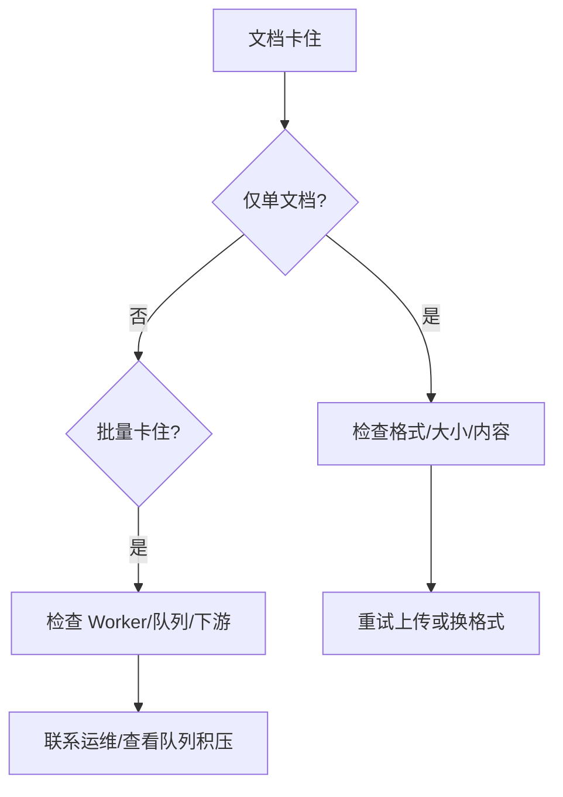

# 文档卡住排障

快速判断文档是**正常排队、可恢复失败、还是需要环境修复**，并输出可交给研发或运维的证据链。

## 前置条件

- 已知 `document_id` 与关联的 `dataset_id`
- 具备读取文档详情与状态的 API 权限
- 多租户部署下已携带正确的租户上下文（见 [租户 Header](../patterns/tenant-headers.md)）

## 诊断步骤

### Step 1 — 查看文档权威状态

```bash
curl -s "$BASE_URL/api/v1/documents/$DOCUMENT_ID/status" \
  -H "Authorization: Bearer $TOKEN" | jq '{status, error, updated_at}'
```

根据返回判断：
- `processing` + 近期 `updated_at` → 正在处理，继续等待
- `processing` + 长时间无变化 → 可能卡住
- `failed` + `error` 字段 → 明确失败，查看错误信息

### Step 2 — 检查解析/流水线阶段

如果环境暴露 Pipeline 相关接口，查看当前处理阶段：

```bash
# 查看文档处理详情（路径以 OpenAPI 为准）
curl -s "$BASE_URL/api/v1/documents/$DOCUMENT_ID" \
  -H "Authorization: Bearer $TOKEN" | jq '{status, pipeline_stage, chunks_count}'
```

### Step 3 — 检查环境健康

```bash
# 检查依赖服务状态
curl -s "$BASE_URL/api/v1/health/ready" \
  -H "Authorization: Bearer $TOKEN" | jq .
```

:::warning
如果 `/health/ready` 报告依赖不可用（解析器、队列、对象存储），这是系统级问题，需运维介入。
:::

### Step 4 — 缩小范围



- **仅单文档失败** → 优先怀疑格式、内容、文件大小
- **批量卡住** → 优先怀疑 Worker 状态、队列积压、下游配额

### Step 5 — 输出诊断简报

整理以下信息，便于跨团队协作：

| 字段 | 示例 |
|------|------|
| 环境 | `staging / prod` |
| 数据集 | `dataset_id: abc-123` |
| 文档 | `document_id: def-456` |
| 上传时间 | `2024-01-15T10:30:00Z` |
| 当前状态 | `processing`（已停留 2 小时） |
| 已尝试动作 | 重新上传一次，同样卡住 |
| Request-ID | `req-789`（如有） |

## 常见原因与修复

| 现象 | 可能原因 | 修复方法 |
|------|----------|----------|
| 解析器 5xx | 依赖未启动、镜像版本不匹配 | 检查容器日志，重启解析服务 |
| 长时间无状态变化 | Worker 未消费、死信队列 | 查 Worker 日志与队列管理面板 |
| 仅特定格式失败 | 解析器插件或驱动缺失 | 换格式试传以二分法定位 |
| 大文件超时 | 上传 body 被代理截断 | 调整 Nginx `client_max_body_size` |

## 预防措施

- 配置文档处理的超时告警（如 processing 超过 30 分钟）
- 定期检查 Worker 队列深度与消费速率
- 上线前在各环境测试主要文件格式（PDF / DOCX / TXT）

## 相关链接

- [新租户首日上线](./go-live-tenant.md) — 确认基础路径无误
- [知识库问答](./knowledge-base-qa.md) — 处理完成后的检索验收
- [错误码与响应体](../patterns/errors-4xx-5xx.md) — 理解返回的错误码
- [Redoc — API 完整参考](https://skygazer42.github.io/MimirQ/)
