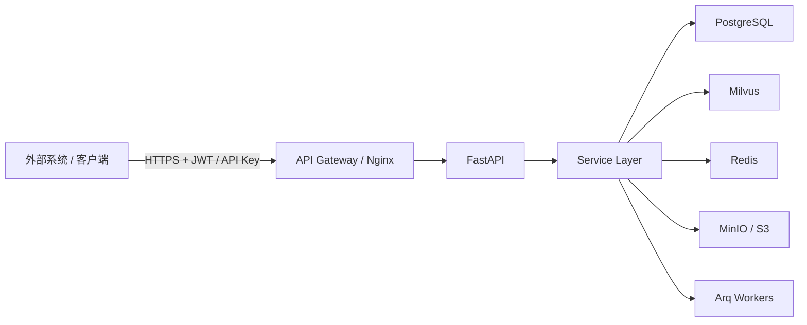
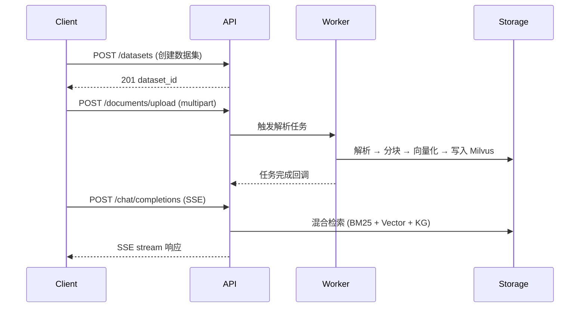

# 集成与联调总览

本分区从 **「如何把 MimirQ 接进你的环境」** 出发，与 Frontend / Backend / Ops 文档互补：那边讲页面与实现细节，这里讲 **业务结果、推荐路径与契约入口**。

## 集成架构总览

## 典型集成序列

## 三层叙事（按需选一层）

### 业务层：我要达成什么结果？

- **按角色选入口**（谁来看、从哪开始）：
  [租户与系统管理员](./roles/admin) | [集成工程师](./roles/integration-engineer) | [运维 / SRE](./roles/sre-ops)
- **按任务走剧本**（单页深度、可验收）：
  [新租户首日上线](./tasks/go-live-tenant) | [知识库可对用户问答](./tasks/knowledge-base-qa) | [文档卡在解析或索引](./tasks/document-stuck)

### 操作层：具体怎么调、顺序是什么？

- **业务场景剧本**（端到端、含 curl 示例）：
  [上传并对话](./scenarios/s01-upload-chat) | [数据集 RAG](./scenarios/s02-dataset-rag) | [预检拦截](./scenarios/s03-precheck-block) | [检索调试](./scenarios/s04-retrieval-debug) | [更多场景 ...](./scenarios/s05-kg-trigger)
- **集成模式速查**（通用机制）：
  [认证模式](./patterns/auth-modes) | [分页](./patterns/pagination) | [Multipart 上传](./patterns/multipart-upload) | [SSE Streaming](./patterns/sse-streaming) | [错误码](./patterns/errors-4xx-5xx) | [幂等与重试](./patterns/idempotency-retries)

### 契约层：字段、权限、覆盖是否一致？

- **人机可读契约**：[API_CONTRACT](https://github.com/skygazer42/MimirQ/blob/main/docs/integration/API_CONTRACT.md) | [前后端排障](https://github.com/skygazer42/MimirQ/blob/main/docs/integration/FE_BE_DEBUG.md)
- **全量 Schema / 试调用**：[OpenAPI / Redoc](https://skygazer42.github.io/MimirQ/)
- **前端路由 - 后端路径矩阵**：[前后端矩阵（生成）](./generated/fe-be-matrix)

## 端点速查

| 业务域 | 关键端点 | 端到端文档 |
| --- | --- | --- |
| Datasets | `POST /datasets`, `GET /datasets/{id}`, `DELETE /datasets/{id}` | [E2E](./datasets/e2e) |
| Documents | `POST /documents/upload`, `GET /documents/{id}/status` | [E2E](./documents/e2e) |
| Chat | `POST /chat/completions` (SSE) | [场景 S01](./scenarios/s01-upload-chat) |
| Retrieval | `POST /retrieval/search` | [场景 S04](./scenarios/s04-retrieval-debug) |
| KG | `POST /kg/trigger`, `GET /kg/{id}/graph` | [场景 S05](./scenarios/s05-kg-trigger) |
| Evaluations | `POST /evaluations/jobs` | [场景 S07](./scenarios/s07-eval-job) |
| Governance | `POST /governance/quarantine` | [场景 S09](./scenarios/s09-governance-quarantine) |

## 认证流程概览

:::info 认证方式
MimirQ 支持三种认证方式，按优先级选择：

1. **JWT Bearer Token** -- `Authorization: Bearer <token>`，适用于前端与 OAuth 集成
2. **API Key** -- `X-API-Key: <key>`，适用于服务间调用与自动化脚本
3. **租户 Header** -- `X-Tenant-ID: <tenant>`，多租户隔离标识（必须与上述认证方式搭配使用）

详见 [认证模式](./patterns/auth-modes) | [租户 Header](./patterns/tenant-headers)
:::

## 与仓库 `docs/integration/` 的关系

站内文章侧重 **导航与整合**；深度长文、清单类仍以 GitHub 上 `docs/integration/*.md` 为准（上表已链出常用篇）。

## 相关链接

| 类型 | 链接 |
| --- | --- |
| Redoc | [skygazer42.github.io/MimirQ](https://skygazer42.github.io/MimirQ/) |
| 场景化 API 顺序 | [workflows.md](https://github.com/skygazer42/MimirQ/blob/main/docs/api/workflows.md) |
| 契约与排障 | [API_CONTRACT](https://github.com/skygazer42/MimirQ/blob/main/docs/integration/API_CONTRACT.md) | [FE_BE_DEBUG](https://github.com/skygazer42/MimirQ/blob/main/docs/integration/FE_BE_DEBUG.md) |
| 后端手册 | [后端总览](../backend/welcome) |
| 前端手册 | [前端总览](../frontend/welcome) |
| 运维手册 | [运维总览](../ops/welcome) |
