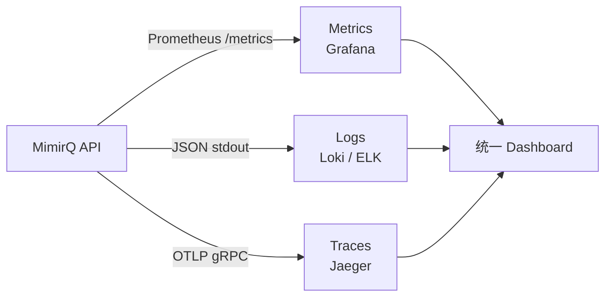

# 可观测性

MimirQ 基于可观测性三支柱（Metrics、Logs、Traces）构建完整的生产监控体系，帮助运维团队快速定位性能瓶颈和异常根因。

## 三支柱概览



## Prometheus 指标

MimirQ 在 `/metrics` 端点暴露 Prometheus 格式指标，核心指标如下：

| 指标名 | 类型 | 说明 |
|--------|------|------|
| `mimirq_http_requests_total` | Counter | HTTP 请求总数（按 method/path/status 分组） |
| `mimirq_http_request_duration_seconds` | Histogram | 请求延迟分布 |
| `mimirq_rag_query_duration_seconds` | Histogram | RAG 查询端到端耗时 |
| `mimirq_rag_retrieval_duration_seconds` | Histogram | 检索阶段耗时 |
| `mimirq_llm_tokens_total` | Counter | LLM token 消耗（按 model/direction 分组） |
| `mimirq_task_queue_depth` | Gauge | 异步任务队列当前深度 |
| `mimirq_task_processing_duration_seconds` | Histogram | 任务处理耗时 |
| `mimirq_db_pool_connections` | Gauge | 数据库连接池使用量（按 state 分组） |
| `mimirq_milvus_search_duration_seconds` | Histogram | Milvus 向量检索耗时 |
| `mimirq_embedding_batch_duration_seconds` | Histogram | Embedding 批量推理耗时 |

### Grafana Dashboard

导入预置 Dashboard：

```bash
# 方式一：通过 Grafana UI 导入
# Dashboards → Import → 上传 JSON 文件
cp deploy/grafana/mimirq-overview.json /var/lib/grafana/dashboards/

# 方式二：通过 Provisioning 自动加载
# grafana/provisioning/dashboards/mimirq.yaml 已包含配置
```

:::tip
Dashboard 包含 4 个核心面板：请求概览、RAG 管线性能、任务队列状态、资源使用率。可按需在 `deploy/grafana/` 目录下自定义。
:::

## 结构化日志

MimirQ 使用 JSON 格式输出日志，便于 Loki、ELK 等系统采集和查询。

```json
{
  "timestamp": "2026-04-02T10:15:30.123Z",
  "level": "INFO",
  "logger": "mimirq.rag.engine",
  "message": "RAG query completed",
  "request_id": "req-a1b2c3d4",
  "user_id": "u-1001",
  "duration_ms": 1280,
  "retrieval_count": 12,
  "model": "gpt-4o"
}
```

关键日志字段：

| 字段 | 说明 |
|------|------|
| `request_id` | 请求追踪 ID，与 Trace ID 关联 |
| `user_id` | 操作用户 |
| `duration_ms` | 操作耗时（毫秒） |
| `dataset_id` | 数据集 ID（数据操作时） |
| `error_code` | 错误码（仅错误日志） |

:::info
日志级别通过环境变量 `LOG_LEVEL` 控制，支持 `DEBUG` / `INFO` / `WARNING` / `ERROR`，默认为 `INFO`。
:::

## 告警规则

以下为推荐的 Prometheus 告警规则：

```yaml
groups:
  - name: mimirq-alerts
    rules:
      - alert: HighErrorRate
        expr: |
          rate(mimirq_http_requests_total{status=~"5.."}[5m])
          / rate(mimirq_http_requests_total[5m]) > 0.05
        for: 3m
        labels:
          severity: critical
        annotations:
          summary: "MimirQ 5xx 错误率超过 5%"

      - alert: TaskQueueBacklog
        expr: mimirq_task_queue_depth > 500
        for: 5m
        labels:
          severity: warning
        annotations:
          summary: "任务队列积压超过 500"

      - alert: HighRAGLatency
        expr: |
          histogram_quantile(0.95, rate(mimirq_rag_query_duration_seconds_bucket[5m])) > 10
        for: 5m
        labels:
          severity: warning
        annotations:
          summary: "RAG P95 延迟超过 10 秒"

      - alert: DBConnectionPoolExhausted
        expr: |
          mimirq_db_pool_connections{state="used"}
          / mimirq_db_pool_connections{state="total"} > 0.9
        for: 2m
        labels:
          severity: critical
        annotations:
          summary: "数据库连接池使用率超过 90%"
```

## 分布式追踪

MimirQ 通过 OpenTelemetry SDK 上报 Trace 数据，支持 Jaeger 和 OTLP 兼容的后端。

```bash
# 环境变量配置
OTEL_ENABLED=true
OTEL_EXPORTER_OTLP_ENDPOINT=http://jaeger:4317
OTEL_SERVICE_NAME=mimirq-api
```

追踪覆盖的关键 Span：

| Span 名称 | 说明 |
|-----------|------|
| `http.request` | HTTP 请求入口 |
| `rag.query` | RAG 查询完整流程 |
| `rag.retrieval` | 向量检索 + 重排 |
| `rag.generation` | LLM 生成阶段 |
| `task.process` | 异步任务处理 |
| `db.query` | 数据库查询 |

:::warning
生产环境建议设置采样率（`OTEL_TRACES_SAMPLER_ARG=0.1`），避免 Trace 数据量过大影响性能。
:::

---

**相关链接**

- [健康探针](./health-probes.md) — 端点详情与 K8s 探针配置
- [运行时配置](./settings-meta.md) — 可观测性相关环境变量
- [部署指南](./deployment.md) — Grafana / Jaeger 部署配置
