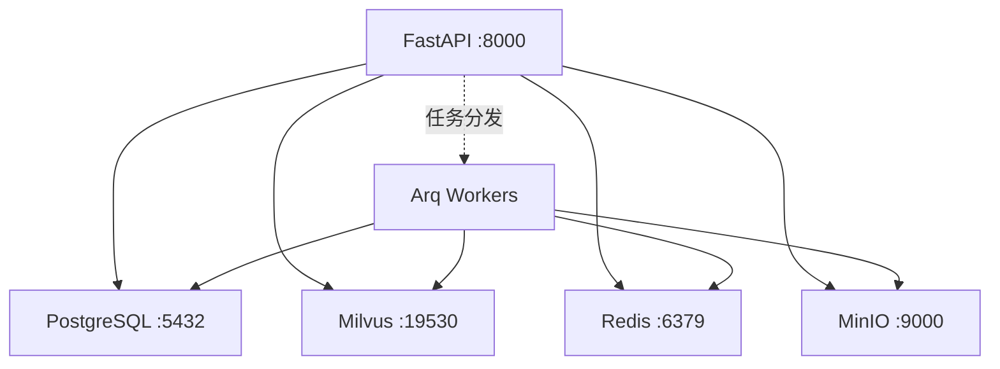

# 运维手册总览

本手册面向 **运维工程师、SRE 与平台管理员**，覆盖 MimirQ 的部署方式、健康检查、可观测性与日常运维操作。

## 服务概览

| 服务 | 默认端口 | 健康检查端点 | 说明 |
| --- | --- | --- | --- |
| FastAPI (主服务) | 8000 | `GET /api/v1/health/ready` | API 入口 |
| Arq Worker | — | `make worker-check` | 文档解析、索引等异步任务 |
| PostgreSQL | 5432 | `pg_isready` | 关系数据存储 |
| Milvus | 19530 | gRPC health check | 向量数据库 |
| Redis | 6379 | `redis-cli ping` | 缓存与消息队列 |
| MinIO | 9000 / 9001 | `GET /minio/health/live` | 对象存储 |

## 基础设施依赖

## 部署方式对比

| 方式 | 适用场景 | 优点 | 缺点 |
| --- | --- | --- | --- |
| **Docker Compose** | 本地开发、PoC、小团队 | 一键启动、配置简单 | 无自动扩缩、无高可用 |
| **Helm / K8s** | 生产环境、多租户 | 弹性伸缩、滚动更新、健康探针 | 运维复杂度高 |
| **源码部署** | 深度调试、定制开发 | 完全可控 | 需手动管理依赖与进程 |

:::tip 推荐
生产环境推荐 Helm / K8s 部署，搭配 PostgreSQL 高可用集群与 Milvus 分布式模式。本地开发使用 Docker Compose 即可。
:::

## 可观测性

### Prometheus 指标

设置 `PROMETHEUS_ENABLED=true` 后，MimirQ 暴露 Prometheus 兼容的 `/metrics` 端点：

| 指标类别 | 示例 | 说明 |
| --- | --- | --- |
| HTTP 请求 | `http_requests_total`, `http_request_duration_seconds` | 按路由、方法、状态码分组 |
| 并发请求 | `http_requests_in_progress` | 当前 API 并发量 |

Arq 队列、PostgreSQL、Milvus、Redis 与 MinIO 的运行状态应结合应用日志、`make worker-check` 和各依赖自身的 exporter 监控；MimirQ 不会直接暴露队列层的专用指标。

### Grafana Dashboard

建议配置以下面板：

- **API 概览** -- 请求量、延迟 P50/P95/P99、错误率
- **任务队列** -- 待处理数、执行时长、失败率
- **存储** -- PostgreSQL 连接池、Milvus 查询延迟、Redis 命中率
- **资源** -- CPU、内存、磁盘 I/O

详见 [可观测性配置](./observability)。

## 关键运维操作

| 操作 | 文档 |
| --- | --- |
| 首次安装与最小配置 | [快速开始](./getting-started) |
| 健康探针配置 | [健康检查](./health-probes) |
| 监控与告警 | [可观测性](./observability) |
| 部署与升级 | [部署指南](./deployment) |
| 配置与元数据 | [配置管理](./settings-meta) |

## 日常巡检清单

:::note 每日巡检
1. 检查所有服务健康端点返回 200
2. 使用 `make worker-check` 确认 Arq Worker 正常发布存活标记
3. 检查 PostgreSQL 连接池使用率 < 80%
4. 确认 Milvus 集合同步状态正常
5. 检查磁盘使用率（MinIO 存储 / PostgreSQL WAL）
6. 查看 Grafana 告警面板是否有未处理告警
:::

## 关键配置文件

| 文件 | 用途 |
| --- | --- |
| `docker/docker-compose*.yml` | Docker Compose 编排 |
| `deploy/helm/mimirq/` | Helm Chart 模板 |
| `.env.example` / `app/core/config.py` | 环境变量模板与应用配置定义 |
| `alembic.ini` | 数据库迁移配置 |
| `.env` / `web/.env.local` | 本地后端与前端环境变量 |

:::warning 敏感配置
数据库密码、JWT 密钥、API Key 等敏感配置请通过环境变量或 Kubernetes Secret 注入，切勿提交到代码仓库。
:::

## 相关链接

- [OpenAPI / Redoc](https://skygazer42.github.io/MimirQ/)
- [快速入门](./getting-started)
- [后端总览](../backend/welcome)
- [前端总览](../frontend/welcome)
- [集成与联调总览](../integration/welcome)
- [SRE / 运维角色指南](../integration/roles/sre-ops)
