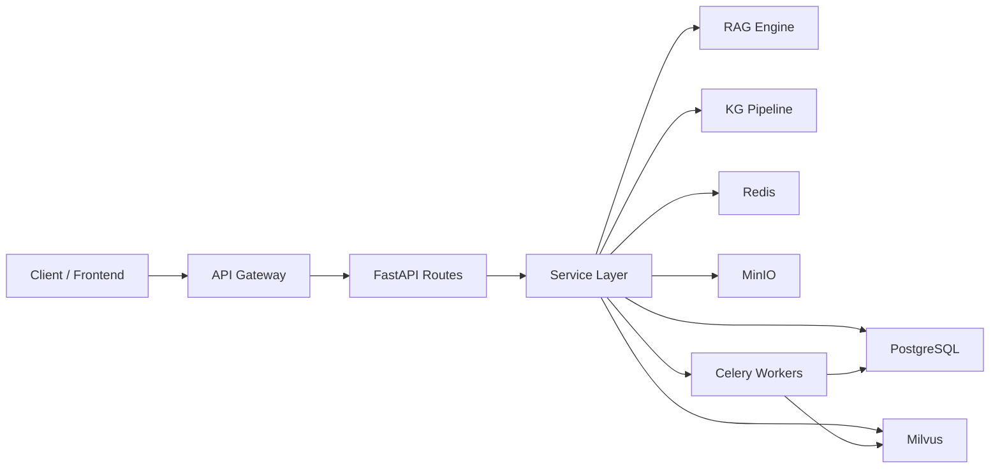

# Backend Handbook Overview

This handbook is for **backend developers, architects, and integration engineers**, helping you quickly understand MimirQ backend's module boundaries, API contracts, and internal flows. Use [OpenAPI / Redoc](https://skygazer42.github.io/MimirQ/) as the authoritative Schema reference; this handbook focuses on **navigation indexes, state-machine descriptions, and troubleshooting guides**.

## Tech Stack

| Layer | Technology | Version / Notes |
| --- | --- | --- |
| Web Framework | FastAPI | 0.135 |
| ORM | SQLAlchemy | 2.0 (async) |
| Vector Database | Milvus | 2.x (BM25 + SPLADE + ColBERT ANN hybrid retrieval) |
| Relational Database | PostgreSQL | Primary storage |
| Cache / Queue | Redis | Session, rate limiting & Pub/Sub |
| Task Queue | Celery | Async parsing, indexing, evaluation tasks |
| Object Storage | MinIO / S3-compatible | Raw document files |

## System Architecture

## Module Map

| Domain | Overview | API Index | State Machine / Troubleshooting |
| --- | --- | --- | --- |
| Datasets | [Overview](./datasets/overview) | [API Index](./datasets/api-index) | [State & Jobs](./datasets/state-jobs) / [Troubleshooting](./datasets/troubleshooting) |
| Documents | [Overview](./documents/overview) | [API Index](./documents/api-index) | [State & Jobs](./documents/state-jobs) / [Troubleshooting](./documents/troubleshooting) |
| Chat | [Chat Module](./more/chat) | — | — |
| Retrieval | [Retrieval Module](./more/retrieval) | — | — |
| Knowledge Graph (KG) | [KG Module](./more/kg) | — | — |
| Evaluations | [Evaluations Module](./more/evaluations) | — | — |
| Governance | [Governance Module](./more/governance) | — | — |
| Parsing | [Parsing Module](./more/parsing) | — | — |
| Evidence | [Evidence Module](./more/evidence) | — | — |
| Platform | [Platform Module](./more/platform) | — | — |

## Suggested Reading Order

:::tip Reading Path
1. **This page** -- Establish the big picture
2. **Datasets** -- [Overview](./datasets/overview) → [API Index](./datasets/api-index) → [Schema](./datasets/schemas) → [State & Jobs](./datasets/state-jobs)
3. **Documents** -- [Overview](./documents/overview) → [Pipeline](./documents/pipeline) → [State & Jobs](./documents/state-jobs)
4. **Retrieval & RAG** -- [Retrieval](./more/retrieval) → [KG](./more/kg) → [Chat](./more/chat)
5. **Governance & Evaluations** -- [Governance](./more/governance) → [Evaluations](./more/evaluations)
6. **Integration Troubleshooting** -- Each domain's `troubleshooting` page + [Integration Overview](../integration/welcome)
:::

## Embedding & Model Support

The backend ships with 15 embedding models across 7 providers, defaulting to `BAAI/bge-m3`. The RAG Engine supports hybrid orchestration of four retrieval modes -- Vector, BM25, SPLADE, and ColBERT ANN -- and can be flexibly switched via configuration.

## Key Configuration & File Paths

| File | Purpose |
| --- | --- |
| `app/core/config.py` | 800+ config entries, driven by pydantic-settings |
| `alembic.ini` / `alembic/` | Database migrations |
| `docker-compose.yml` | Local dev environment orchestration |
| `app/rag/engine.py` | RAGEngine main flow (streaming) |
| `app/rag/retriever.py` | HybridRetriever hybrid retrieval |
| `app/rag/pipelines/langgraph.py` | LangGraph Functional API pipeline |
| `app/rag/kg/` | Knowledge graph extraction / recall / expansion / reranking |

:::info Configuration Priority
Environment variables > `.env` file > `config.py` defaults. For production deployments, inject sensitive configuration via environment variables.
:::

## Related Links

- [OpenAPI / Redoc](https://skygazer42.github.io/MimirQ/)
- [Frontend Handbook Overview](../frontend/welcome)
- [Integration & E2E Overview](../integration/welcome)
- [Operations Overview](../ops/welcome)
