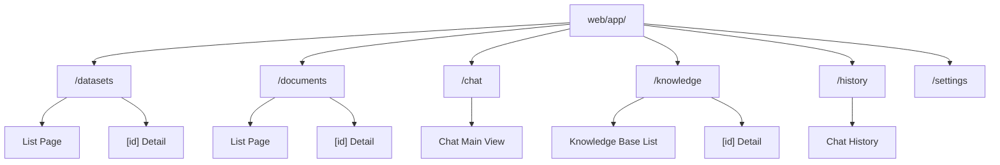

# Frontend Handbook Overview

This handbook is for **frontend developers and full-stack engineers**, helping you understand MimirQ Web's routing structure, component system, and API call layer. Types and paths use [OpenAPI / Redoc](https://skygazer42.github.io/MimirQ/) as the authoritative reference; frontend routes follow `web/app/**/page.tsx`.

## Tech Stack

| Layer | Technology | Notes |
| --- | --- | --- |
| Framework | Next.js 14 | App Router |
| UI Library | React 19 | Server & Client Components |
| Language | TypeScript 5.x | Strict mode |
| Styling | Tailwind CSS | Utility-first |
| Component Library | shadcn/ui | Based on Radix UI |
| Data Fetching | TanStack Query | Progressive migration (some still use useEffect manual fetch) |
| State Management | Zustand | Lightweight global state |
| Internationalization | next-intl | Chinese & English |
| Package Manager | pnpm | Workspace |

## Route Tree

## Page Route Overview

| Route | Page | Core Component |
| --- | --- | --- |
| `/datasets` | Dataset List | `datasets-page.tsx` |
| `/datasets/[id]` | Dataset Detail | `dataset-categories/category-tree.tsx` |
| `/documents` | Document Management | — |
| `/chat` | Chat Interface | `chat-area.tsx`, `message-item.tsx` |
| `/knowledge` | Knowledge Base | `knowledge-page.tsx`, `knowledge-inspector.tsx` |
| `/history` | Chat History | `page-client.tsx` |
| `/settings` | System Settings | — |

## API Client Modules

All backend calls are centralized under the `web/lib/api/` directory:

| File | Responsibility |
| --- | --- |
| `core.ts` | Request base layer (fetch wrapper, error handling, auth headers) |
| `datasets.ts` | Dataset CRUD |
| `documents.ts` | Document upload, parsing, status |
| Other modules | Split by business domain |

:::info Type Generation
`web/types/openapi.ts` is auto-generated by openapi-typescript; `web/types/backend.ts` provides alias mappings. After backend Schema changes, run `openapi-export` to regenerate.
:::

## State Management Strategy

| Approach | Scenario | Current Status |
| --- | --- | --- |
| TanStack Query | Server data caching & sync | 8 files use `useQuery`, expanding |
| Zustand | Pure frontend global state (UI preferences, etc.) | Light usage |
| `useEffect` + `useState` | Manual fetch | Legacy, gradually migrating to TanStack Query |

:::tip Migration Direction
For new features, prefer TanStack Query's `useQuery` / `useMutation`. QueryProvider is already configured in `layout.tsx`.
:::

## Key Component Map

| Component | Path | Description |
| --- | --- | --- |
| ChatArea | `web/components/chat-area.tsx` | Core chat area, SSE streaming |
| MessageItem | `web/components/chat/message-item.tsx` | Single message rendering (with Markdown) |
| KnowledgePage | `web/components/knowledge/knowledge-page.tsx` | Knowledge base main page |
| KnowledgeInspector | `web/components/knowledge/knowledge-inspector.tsx` | Knowledge base inspector |
| CategoryTree | `web/components/dataset-categories/category-tree.tsx` | Dataset category tree |
| DatasetsPage | `web/components/datasets/datasets-page.tsx` | Dataset list |

## Suggested Reading Order

:::tip Reading Path
1. **This page** -- Big picture
2. **Datasets** -- [Overview](./datasets/overview) → [API Client](./datasets/api-client) → [Catalog UI](./datasets/catalog-ui)
3. **Documents** -- [Overview](./documents/overview) → [API Client](./documents/api-client) → [State UI](./documents/state-ui)
4. **More Modules** -- [Chat](./more/chat) → [Knowledge](./more/retrieval) → [KG](./more/kg)
5. **Troubleshooting** -- Each domain's `troubleshooting` / `errors` page
:::

## Related Links

- [OpenAPI / Redoc](https://skygazer42.github.io/MimirQ/)
- [Backend Handbook Overview](../backend/welcome)
- [Integration & E2E Overview](../integration/welcome)
- [Operations Overview](../ops/welcome)
