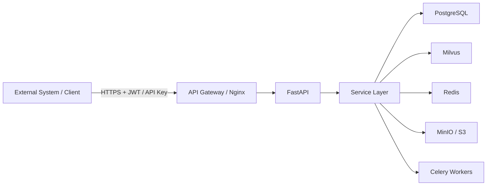
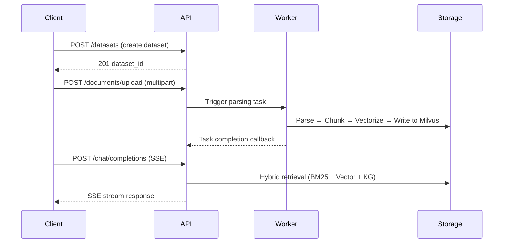

# Integration & E2E Overview

This section starts from **"How to integrate MimirQ into your environment"** and complements the Frontend / Backend / Ops documentation: those cover pages and implementation details, while this section focuses on **business outcomes, recommended paths, and contract entry points**.

## Integration Architecture Overview

## Typical Integration Sequence

## Three Narrative Layers (Pick the One You Need)

### Business Layer: What outcome do I want?

- **Pick your entry point by role** (who is reading, where to start):
  [Tenant & System Admin](./roles/admin) | [Integration Engineer](./roles/integration-engineer) | [SRE / Ops](./roles/sre-ops)
- **Follow a task playbook** (single-page depth, verifiable):
  [New Tenant Go-Live](./tasks/go-live-tenant) | [Knowledge Base Ready for Q&A](./tasks/knowledge-base-qa) | [Document Stuck in Parsing or Indexing](./tasks/document-stuck)

### Operations Layer: How exactly do I call it, and in what order?

- **Business scenario playbooks** (end-to-end, with curl examples):
  [Upload & Chat](./scenarios/s01-upload-chat) | [Dataset RAG](./scenarios/s02-dataset-rag) | [Precheck Block](./scenarios/s03-precheck-block) | [Retrieval Debug](./scenarios/s04-retrieval-debug) | [More scenarios ...](./scenarios/s05-kg-trigger)
- **Integration pattern quick reference** (common mechanisms):
  [Auth Modes](./patterns/auth-modes) | [Pagination](./patterns/pagination) | [Multipart Upload](./patterns/multipart-upload) | [SSE Streaming](./patterns/sse-streaming) | [Error Codes](./patterns/errors-4xx-5xx) | [Idempotency & Retries](./patterns/idempotency-retries)

### Contract Layer: Are fields, permissions, and coverage consistent?

- **Human & machine-readable contracts**: [API_CONTRACT](https://github.com/skygazer42/MimirQ/blob/main/docs/integration/API_CONTRACT.md) | [FE/BE Debugging](https://github.com/skygazer42/MimirQ/blob/main/docs/integration/FE_BE_DEBUG.md)
- **Full Schema / try calls**: [OpenAPI / Redoc](https://skygazer42.github.io/MimirQ/)
- **Frontend route - Backend path matrix**: [FE/BE Matrix (generated)](./generated/fe-be-matrix)

## Endpoint Quick Reference

| Domain | Key Endpoints | E2E Docs |
| --- | --- | --- |
| Datasets | `POST /datasets`, `GET /datasets/{id}`, `DELETE /datasets/{id}` | [E2E](./datasets/e2e) |
| Documents | `POST /documents/upload`, `GET /documents/{id}/status` | [E2E](./documents/e2e) |
| Chat | `POST /chat/completions` (SSE) | [Scenario S01](./scenarios/s01-upload-chat) |
| Retrieval | `POST /retrieval/search` | [Scenario S04](./scenarios/s04-retrieval-debug) |
| KG | `POST /kg/trigger`, `GET /kg/{id}/graph` | [Scenario S05](./scenarios/s05-kg-trigger) |
| Evaluations | `POST /evaluations/jobs` | [Scenario S07](./scenarios/s07-eval-job) |
| Governance | `POST /governance/quarantine` | [Scenario S09](./scenarios/s09-governance-quarantine) |

## Authentication Flow Overview

:::info Authentication Methods
MimirQ supports three authentication methods, in order of priority:

1. **JWT Bearer Token** -- `Authorization: Bearer <token>`, suitable for frontend and OAuth integrations
2. **API Key** -- `X-API-Key: <key>`, suitable for service-to-service calls and automation scripts
3. **Tenant Header** -- `X-Tenant-ID: <tenant>`, multi-tenant isolation identifier (must be used in combination with one of the above auth methods)

See [Auth Modes](./patterns/auth-modes) | [Tenant Headers](./patterns/tenant-headers) for details.
:::

## Relationship with Repository `docs/integration/`

Articles on this site focus on **navigation and synthesis**; in-depth long-form documents and checklists remain authoritative at `docs/integration/*.md` on GitHub (the table above links to commonly used ones).

## Related Links

| Type | Link |
| --- | --- |
| Redoc | [skygazer42.github.io/MimirQ](https://skygazer42.github.io/MimirQ/) |
| Scenario-based API Sequences | [workflows.md](https://github.com/skygazer42/MimirQ/blob/main/docs/api/workflows.md) |
| Contracts & Debugging | [API_CONTRACT](https://github.com/skygazer42/MimirQ/blob/main/docs/integration/API_CONTRACT.md) | [FE_BE_DEBUG](https://github.com/skygazer42/MimirQ/blob/main/docs/integration/FE_BE_DEBUG.md) |
| Backend Handbook | [Backend Overview](../backend/welcome) |
| Frontend Handbook | [Frontend Overview](../frontend/welcome) |
| Operations Handbook | [Operations Overview](../ops/welcome) |
