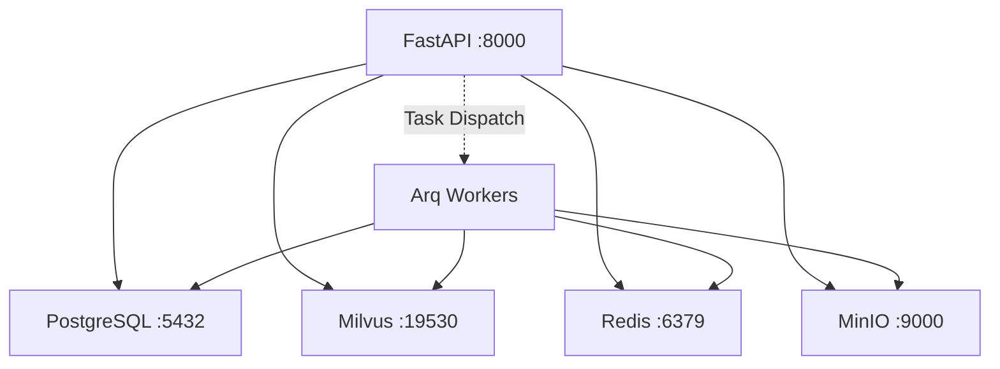

# Operations Handbook Overview

This handbook is for **operations engineers, SREs, and platform administrators**, covering MimirQ's deployment methods, health checks, observability, and routine operations.

## Service Overview

| Service | Default Port | Health Check Endpoint | Description |
| --- | --- | --- | --- |
| FastAPI (Main Service) | 8000 | `GET /api/v1/health/ready` | API entry point |
| Arq Worker | — | `make worker-check` | Document parsing and indexing tasks |
| PostgreSQL | 5432 | `pg_isready` | Relational data storage |
| Milvus | 19530 | gRPC health check | Vector database |
| Redis | 6379 | `redis-cli ping` | Cache & message queue |
| MinIO | 9000 / 9001 | `GET /minio/health/live` | Object storage |

## Infrastructure Dependencies

## Deployment Method Comparison

| Method | Use Case | Pros | Cons |
| --- | --- | --- | --- |
| **Docker Compose** | Local dev, PoC, small teams | One-click start, simple config | No auto-scaling, no HA |
| **Helm / K8s** | Production, multi-tenant | Elastic scaling, rolling updates, health probes | Higher operational complexity |
| **Source Deploy** | Deep debugging, custom dev | Full control | Manual dependency & process management |

:::tip Recommendation
For production, Helm / K8s deployment is recommended, paired with a PostgreSQL HA cluster and Milvus distributed mode. Use Docker Compose for local development.
:::

## Observability

### Prometheus Metrics

With `PROMETHEUS_ENABLED=true`, MimirQ exposes a Prometheus-compatible `/metrics` endpoint:

| Metric Category | Examples | Description |
| --- | --- | --- |
| HTTP Requests | `http_requests_total`, `http_request_duration_seconds` | Grouped by route, method, status code |
| In-flight Requests | `http_requests_in_progress` | Current API concurrency |

Monitor Arq, PostgreSQL, Milvus, Redis, and MinIO through application logs, `make worker-check`, and dependency-specific exporters; MimirQ does not expose queue-specific metrics directly.

### Grafana Dashboard

Recommended panels:

- **API Overview** -- Request volume, latency P50/P95/P99, error rate
- **Task Queue** -- Pending count, execution duration, failure rate
- **Storage** -- PostgreSQL connection pool, Milvus query latency, Redis hit rate
- **Resources** -- CPU, memory, disk I/O

See [Observability Configuration](./observability) for details.

## Key Operations

| Operation | Documentation |
| --- | --- |
| Full path from dataset to evaluation | [Full Operation Guide](../guide/welcome) |
| First install and minimum configuration | [Quick Start](./getting-started) |
| Health Probe Configuration | [Health Checks](./health-probes) |
| Monitoring & Alerting | [Observability](./observability) |
| Deployment & Upgrades | [Deployment Guide](./deployment) |
| Configuration & Metadata | [Settings Management](./settings-meta) |

## Daily Inspection Checklist

:::note Daily Checks
1. Verify all service health endpoints return 200
2. Run `make worker-check` to confirm the Arq worker heartbeat
3. Check PostgreSQL connection pool utilization < 80%
4. Confirm Milvus collection sync status is normal
5. Check disk usage (MinIO storage / PostgreSQL WAL)
6. Review Grafana alert panel for unresolved alerts
:::

## Key Configuration Files

| File | Purpose |
| --- | --- |
| `docker/docker-compose*.yml` | Docker Compose orchestration |
| `deploy/helm/mimirq/` | Helm Chart templates |
| `.env.example` / `app/core/config.py` | Environment template and application settings |
| `alembic.ini` | Database migration config |
| `.env` / `web/.env.local` | Local backend and frontend environment variables |

:::warning Sensitive Configuration
Database passwords, JWT secrets, API keys, and other sensitive configuration should be injected via environment variables or Kubernetes Secrets. Never commit them to the code repository.
:::

## Related Links

- [OpenAPI / Redoc](https://skygazer42.github.io/MimirQ/)
- [Quick Start](./getting-started)
- [Backend Overview](../backend/welcome)
- [Frontend Overview](../frontend/welcome)
- [Integration & E2E Overview](../integration/welcome)
- [SRE / Ops Role Guide](../integration/roles/sre-ops)
