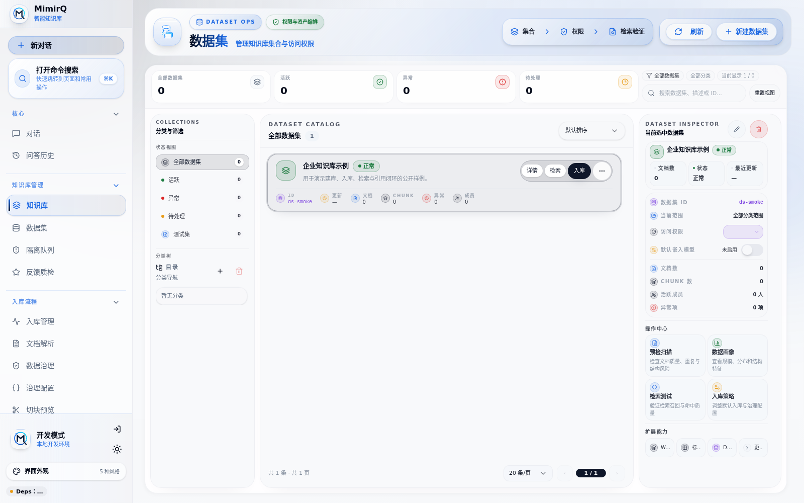
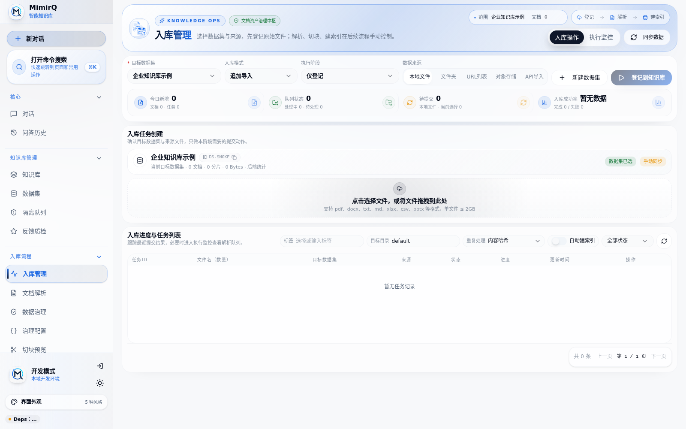
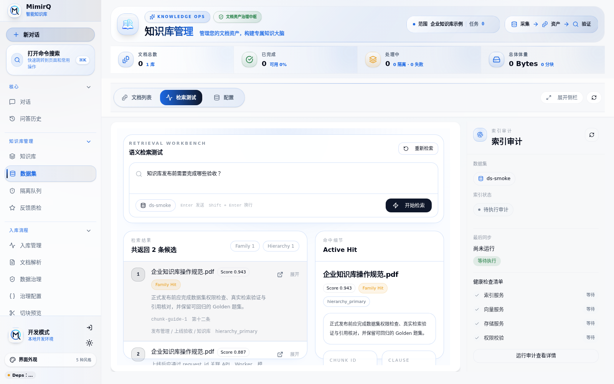
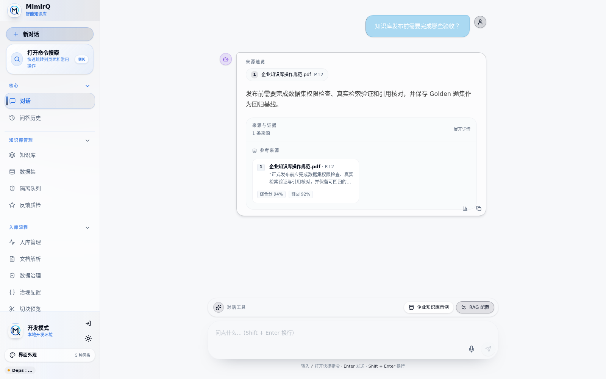

# MimirQ 全流程操作指南

本文面向第一次使用 MimirQ 的管理员、知识库运营人员、研发和测试人员，覆盖从部署到生产运维的完整路径。目标不是罗列全部 API，而是回答四个问题：系统怎么启动、知识库怎么建、效果怎么验收、出现问题怎么定位。

MimirQ 的主流程是：


只想先跑通一遍时，按第 2、3 节操作即可；准备生产部署时，还必须完成第 8 至 11 节。

## 1. 选择使用路径

| 角色 / 目标 | 建议先看 | 主要入口 |
|:---|:---|:---|
| 第一次体验 | [快速入门](./quickstart.md) + 本文第 2、3 节 | `/datasets`、`/knowledge/ingestion`、`/` |
| 知识库运营 | 本文第 3 至 7 节 | `/knowledge`、`/parsing`、`/data-governance` |
| 检索调优 / QA | 本文第 6、7 节 | 知识库的“检索测试”、`/evaluations`、`/reports` |
| Dify / 应用集成 | 本文第 6 节 + [API 工作流](./api/workflows.md) | External Knowledge API 或 HTTP 节点 |
| 平台管理员 / SRE | 本文第 8 至 11 节 | `/settings`、`/diagnostics`、`/observability` |

## 2. 启动并完成首次登录

### 2.1 准备环境

Docker 一键启动需要 Git、Docker Engine 或 Docker Desktop、Docker Compose v2；推荐安装 GNU Make。源码开发还需要 Python 3.11+ 和 pnpm。Windows、macOS 与 Linux 的详细差异见[快速入门](./quickstart.md)。

```bash
git clone --depth 1 --single-branch https://github.com/skygazer42/MimirQ.git
cd MimirQ
make init
```

`make init` 只创建缺失的 `.env` 和 `web/.env.local`，不会覆盖已有配置，并会生成本地安全密钥。

### 2.2 填写最小配置

使用默认 SiliconFlow 模型时，真实问答与向量化至少填写：

```dotenv
LLM_API_KEY=<your-siliconflow-api-key>
```

如果 LLM、Embedding、Reranker 是三个独立服务，还要分别设置各自的 Base URL、Key 和模型名。Reranker 地址必须是完整 rerank 请求端点；更换 Embedding 模型、供应商或向量维度后必须重建已有索引。完整字段见[模型服务与首次管理员配置](./guides/model_services.md)。

无人值守部署建议同时设置：

```dotenv
INITIAL_ADMIN_EMAIL=owner@example.com
INITIAL_ADMIN_USERNAME=owner
INITIAL_ADMIN_PASSWORD=<strong-password>
```

生产环境应改用 `INITIAL_ADMIN_PASSWORD_FILE`。密码变量只用于首次创建 owner，相同账号重启不会重置密码。

### 2.3 启动服务

推荐的完整 Docker Web 栈：

```bash
make up-web
make ps
make api-ping
```

默认会运行 Web、API、Worker、PostgreSQL、Milvus、Etcd、MinIO 和 Redis 共 8 个容器。浏览器打开：

- Web：`http://localhost:3000`
- Swagger：`http://localhost:8000/docs`

源码开发模式使用：

```bash
make setup-host

# 终端 1
make backend

# 终端 2
make web
```

### 2.4 首次登录

- 已配置 `INITIAL_ADMIN_*`：直接使用该账号登录。
- 数据库确实为空且未配置管理员：在 Web 页面注册第一个账户，该账户成为首个 owner。
- 页面提示“首次初始化已关闭”：说明数据库中已有租户或首次 owner 已被创建。应使用现有 owner，或在确认是可丢弃的本地环境后按[Docker 清理指南](./deployment/docker_compose.md#4-数据卷与清理)重建；不要在生产环境盲目删卷。

## 3. 跑通第一个知识库闭环

### 3.1 创建数据集

1. 打开 `/datasets`。
2. 点击“新建数据集”。
3. 填写名称和说明。
4. 选择访问范围并保存。默认 `all_team_members` 允许租户成员读取；敏感知识应改用 `only_me` 或 `partial_members`。

数据集是权限、索引、检索范围和评测基线的边界。不同部门、不同保密范围或不同 Embedding runtime 的资料应拆成独立数据集。



*创建数据集后，可在同一页面检查文档数、Chunk 数、权限范围与后续操作入口。*

### 3.2 可选：先做数据预检

正式批量入库前，可打开 `/datasets/{dataset_id}/precheck` 查看文件类型、文本密度、图片、表格和异常样本，再决定解析器、清洗规则和资源预算。操作细节见[数据集预检](./guides/dataset_precheck.md)。

首次体验可以先用一份小型、无敏感信息、包含唯一测试短语的 PDF、Office 或文本文件。

### 3.3 上传并建立索引

1. 打开 `/knowledge/ingestion?datasetId=<dataset_id>`。
2. 在“执行阶段”选择“解析 + 索引”。
3. 拖入文件或选择本地文件。
4. 确认目标数据集和解析配置。
5. 点击“解析并建索引”。
6. 等待文档从 `pending`、`processing` 进入 `completed`。



*入库工作台统一选择数据集、数据源和执行阶段，并显示任务进度与失败状态。*

`failed` 表示处理失败，`quarantined` 表示治理规则将文档送入隔离区，`cancelled` 表示任务被取消。批量任务可在 `/knowledge/ingestion` 查看，不要反复上传同一文件来掩盖失败原因。

### 3.4 检查解析与切块

- `/parsing`：查看解析任务、后端选择与解析结果。
- `/knowledge`：选择数据集，在“文档列表”查看文档、状态、元数据和 Chunk。
- `/chunk-preview`：上传样本并比较切块策略，确认标题、段落、表格或父子块没有被错误拆开。

Chunk Preview 用于试验参数；正式资产仍应从入库页面进入目标数据集。默认解析器是内置 DeepDoc，复杂文档的选型见第 5 节。

### 3.5 验证检索

1. 打开 `/knowledge`。
2. 选择刚创建的数据集。
3. 切换到“检索测试”。
4. 输入文件中可唯一命中的短语或业务问题。
5. 检查返回 Chunk、文档来源、分数、检索通道和 Trace。



*检索测试把候选排序与命中细节并排展示，用于区分召回、重排和数据范围问题。*

检索结果为空时，先检查文档是否 `completed`、是否生成 Chunk、数据集范围是否正确，再调整 top-k、过滤或重排；不要先修改 LLM Prompt。

### 3.6 验证带引用问答

1. 回到首页 `/`。
2. 点击“选择数据集”，选中刚创建的数据集。
3. 提问一个只能由测试文档回答的问题。
4. 展开回答下方的“来源与证据”。
5. 确认引用卡片指向正确文件，并包含支撑答案的原文。



*生成答案必须能回到具体文件、页码与证据片段；只有回答文本而没有可核对引用，不算完成闭环。*

最小验收标准：

| 检查项 | 通过条件 |
|:---|:---|
| 服务 | `make api-ping` 通过 |
| 文档 | 状态为 `completed` |
| 检索 | 唯一短语能命中正确 Chunk |
| 问答 | 回答与文档一致，不凭空补充关键事实 |
| 引用 | “来源与证据”能定位到正确文件和原文 |

## 4. 日常知识库操作

### 4.1 文档与数据源

| 任务 | 入口 | 说明 |
|:---|:---|:---|
| 手工上传 | `/knowledge/ingestion` | 适合少量文件和首次验证 |
| 文档查看与批量操作 | `/knowledge` | 状态、元数据、生命周期、重处理、删除 |
| URL 导入 | 入库工作台 / API | 见 [URL 入库](./guides/url_ingest.md) |
| 网站或外部系统同步 | Connector | 见 [连接器指南](./guides/connectors.md) |
| 隔离审核 | `/knowledge/quarantine` | 审核治理规则拦截的文档 |
| 失败任务 | `/knowledge/ingestion` | 查看失败原因后重试，不应无限重试 |

内容源长期同步时优先使用 Connector，而不是定期手工覆盖。需要保留历史变化时启用文档版本，并按[版本管理指南](./guides/document_versions.md)执行回滚。

### 4.2 数据治理

1. 在 `/data-governance` 检查分类、标注、质量和清洗结果。
2. 在 `/data-governance/profiles` 创建可复用治理画像。
3. 先预览规则命中和文本变化，再应用到数据集。
4. 被拦截的文档进入 `/knowledge/quarantine`，由有权限的人员审核。

治理规则不应悄悄改变原始证据。重要清洗应保留规则版本、命中统计和可回滚记录。详见[数据治理指南](./guides/data_governance.md)。

### 4.3 权限与共享

数据集支持：

- `all_team_members`：租户成员可读，写操作仍受角色控制。
- `only_me`：仅数据集 owner 可读。
- `partial_members`：owner 与成员/组 allowlist 可读。

成员与角色在 `/settings/rbac` 管理，组在 `/settings/groups` 管理。文档还可叠加文档级 ACL。权限规则默认 fail-closed，具体配置见[数据集权限](./guides/dataset_permissions.md)和[文档 ACL](./guides/document_acl.md)。

## 5. 解析器与切块怎么选

| 文档类型 | 建议起点 | 说明 |
|:---|:---|:---|
| 常规 PDF、Office、文本 | DeepDoc | 默认内置，无需额外容器 |
| PDF 转 Markdown、无 GPU | Marker | `make up-marker` |
| 扫描件、OCR、复杂版面 | PaddleOCR-VL | 需要 NVIDIA GPU |
| 表格、公式、图片较多的 PDF | MinerU pipeline | `make up-mineru`，首次下载模型 |
| VLM 复杂 PDF | MinerU VLM | 资源占用较高 |
| 外部视觉 OCR | Qianfan-OCR / TextIn | 需要上游地址和凭证 |

切块不要只套用固定长度。先按标题、章节、业务记录或父子关系选择策略，再用 `/chunk-preview` 验证。参数和反模式见[切块策略](./guides/chunk_strategies.md)与[切块 Playbook](./guides/chunking_playbook.md)。

解析器改变后通常应重解析；Embedding space 改变后必须重建向量索引。不要把不同维度或不同语义空间的向量混入同一索引。

## 6. 检索、生成与 Dify 接入

MimirQ 将检索证据和 LLM 生成分开看待：

- “检索测试”验证能否找到正确证据。
- 首页问答验证 LLM 能否基于证据生成正确答案。
- 检索正确但回答错误时，重点检查 Prompt、上下文裁剪和上游 LLM；不要为单个业务问题硬编码检索特判。

常见检索问题按[检索排障指南](./guides/retrieval_debugging.md)定位。需要直接消费证据而不生成答案时，使用 [Evidence API](./guides/evidence_api.md)。

Dify 有两种接入方式：

1. **External Knowledge API**：Dify 负责编排与生成，MimirQ 负责检索、重排、权限过滤与证据返回。
2. **Workflow HTTP 节点**：Dify 传入查询、数据集范围和过滤参数，MimirQ 返回证据与 Trace。

标准 External Knowledge 端点为 `POST /api/v1/integrations/dify/retrieval`。映射、会话回填和调用顺序见 [API 工作流](./api/workflows.md)；真实工作流截图和评测见根目录 [README](../README.md#dify-接入)。

## 7. 评测、反馈与证据闭环

### 7.1 建立 Golden 题集

打开 `/evaluations`：

1. 手工录入问题、期望答案和期望引用，或从文档/历史对话生成候选题。
2. 人工审核题目，删除无唯一答案或缺少证据的样本。
3. 固定数据集版本、检索配置和模型配置。
4. 运行基线并保存结果。
5. 每次改解析、切块、Embedding、重排或 Prompt 后重跑并比较差异。

评测运行是异步任务；大题集应关注完成率、准确/部分准确/证据不足、证据覆盖、P50/P95 和失败原因。成熟度与 CI 门禁见[评测成熟度模型](./guides/evaluation_maturity_model.md)和[回归门禁](./guides/regression_gate.md)。

### 7.2 处理线上反馈

- `/knowledge/feedback`：查看用户反馈与 hardcase。
- `/knowledge/evidence` 或数据集 Evidence 页面：核对检索证据。
- `/reports`：导出数据集报告和 RAG Audit。
- `/diagnostics`、`/observability`：按 request ID / Trace 定位运行问题。

把确认过的 hardcase 加入 Golden 题集，形成“线上反馈 → 证据复核 → 修复 → 回归”的闭环。

### 7.3 可选知识图谱

启用 KG 后，可在 `/datasets/{dataset_id}/kg` 或 `/graph` 查看实体、关系和事件。KG 是可选增强通道，不替代基础向量/BM25 检索。启用、抽取、合并和回滚见[知识图谱指南](./guides/knowledge_graph.md)。

## 8. 管理员与安全操作

- `/settings/rbac`：成员、角色与权限。
- `/settings/groups`：用户组和组成员。
- `/audit`：审计事件。
- `/usage`：调用与用量。
- `/settings`：租户和功能配置。

生产环境必须使用正式 JWT、OIDC 或 SAML 认证；不要把调试 Header 模式暴露到公网。密钥通过环境变量、文件 Secret 或 Kubernetes Secret 注入，不得提交 `.env`。上线前检查[安全基线](./deployment/security_baseline.md)。

## 9. 启停、升级、备份与清理

| 目的 | 命令 | 数据 | 镜像 |
|:---|:---|:---:|:---:|
| 查看状态 | `make ps` | 保留 | 保留 |
| 查看日志 | `make logs` | 保留 | 保留 |
| 停止服务 | `make down` | 保留 | 保留 |
| 清空数据重建 | `make docker-reset` | 删除 | 保留 |
| 删除数据和服务镜像 | `make docker-purge` | 删除 | 删除 |

`docker-reset` 和 `docker-purge` 不可恢复。执行前必须完成[备份与恢复指南](./deployment/backup_restore.md)中的备份和恢复演练。MimirQ 使用独立 Compose 项目名 `mimirq`；如何核对项目归属、Windows PowerShell 操作和 Dify 共存恢复见[Docker Compose 部署指南](./deployment/docker_compose.md#4-数据卷与清理)。

生产升级应先备份、阅读发布说明、在预发运行迁移和回归，再发布。数据库迁移、依赖健康和回滚步骤以[运维 Runbook](./deployment/runbook.md)为准。

## 10. 常见问题排障

| 现象 | 首先检查 | 继续阅读 |
|:---|:---|:---|
| 无法打开页面 | Docker Desktop/Engine、`make ps`、Web/API 日志 | [Docker 部署](./deployment/docker_compose.md) |
| 首次管理员无法注册 | 是否已有租户/owner，`INITIAL_ADMIN_*` 是否一致 | [管理员配置](./guides/model_services.md) |
| 文档长期 processing | Worker、Redis、解析器、失败详情 | [任务队列运维](./guides/task_queue_ops.md) |
| completed 但检索为空 | Chunk、索引、dataset scope、ACL、Embedding runtime | [检索排障](./guides/retrieval_debugging.md) |
| 检索正确但答案错误 | Prompt、上下文裁剪、LLM 输出与引用 | [RAG 优化](./guides/rag_optimization.md) |
| 表格/图片证据丢失 | 解析器、版面结果、多模态入库 | [解析与检索诊断](./guides/parse_quality_retrieval_diagnostics.md) |
| 403 | 租户、角色、数据集权限、文档 ACL | [数据集权限](./guides/dataset_permissions.md) |
| 延迟或并发异常 | Trace 各阶段耗时、模型服务、向量库、admission | [可观测性面板](./guides/observability_dashboard.md) |
| Docker 清理出现 Dify | 立即停止，不运行全局 prune，按恢复步骤处理 | [Compose 恢复](./deployment/docker_compose.md#4-数据卷与清理) |

每次报错都保留页面显示的 `request_id`，并在 API、Worker、模型服务和反向代理日志中按同一标识关联排查。

## 11. 生产上线检查清单

- [ ] 使用强 `SECRET_KEY`、PostgreSQL 和 MinIO 凭据。
- [ ] 首个 owner 已创建，临时初始化变量已移除或改用 Secret。
- [ ] 正式认证、租户边界、RBAC、数据集权限和文档 ACL 已验证。
- [ ] LLM、Embedding、Reranker 做过真实调用，不只看 readiness。
- [ ] 至少一份真实样本文档完成解析、切块、索引、检索和带引用问答。
- [ ] Golden 题集、基线结果和发布阈值已保存。
- [ ] API、Worker、PostgreSQL、Redis、Milvus、MinIO 有监控和告警。
- [ ] 备份可以恢复，恢复后重新验证检索与引用。
- [ ] 反向代理使用 HTTPS，可信代理和来源 IP 配置正确。
- [ ] 已在预发完成升级、迁移、回滚和并发验证。

## 12. Web 页面速查

| 页面 | 路径 | 用途 |
|:---|:---|:---|
| 对话 | `/` | 选择数据集并进行带引用问答 |
| 对话历史 | `/history` | 查看、导出历史会话 |
| 数据集 | `/datasets` | 创建、分类、配置和授权数据集 |
| 知识库 | `/knowledge` | 文档列表、检索测试和配置 |
| 入库管理 | `/knowledge/ingestion` | 上传、Connector Run、处理状态 |
| 隔离区 | `/knowledge/quarantine` | 审核被治理规则拦截的文档 |
| 解析工作台 | `/parsing` | 查看解析任务和结果 |
| 数据治理 | `/data-governance` | 标注、分类、质量和清洗 |
| 切块预览 | `/chunk-preview` | 比较切块策略与边界 |
| 知识图谱 | `/graph` | 浏览与治理 KG |
| 评测 | `/evaluations` | Golden 题集、回归和消融 |
| 报告 | `/reports` | 数据集报告与 RAG Audit |
| 诊断 / 观测 | `/diagnostics`、`/observability` | 请求、检索与依赖诊断 |
| 成员 / 组 | `/settings/rbac`、`/settings/groups` | RBAC 和组管理 |

## 13. 文档导航

- 安装与首次启动：[快速入门](./quickstart.md)
- Docker 与 Windows：[Docker Compose 部署指南](./deployment/docker_compose.md)
- 模型与首次管理员：[模型服务配置](./guides/model_services.md)
- API 调用顺序：[API 工作流](./api/workflows.md)
- 全部专项文档：[文档目录](./README.md)
- 在线全栈手册：`https://skygazer42.github.io/MimirQ/handbook/`
