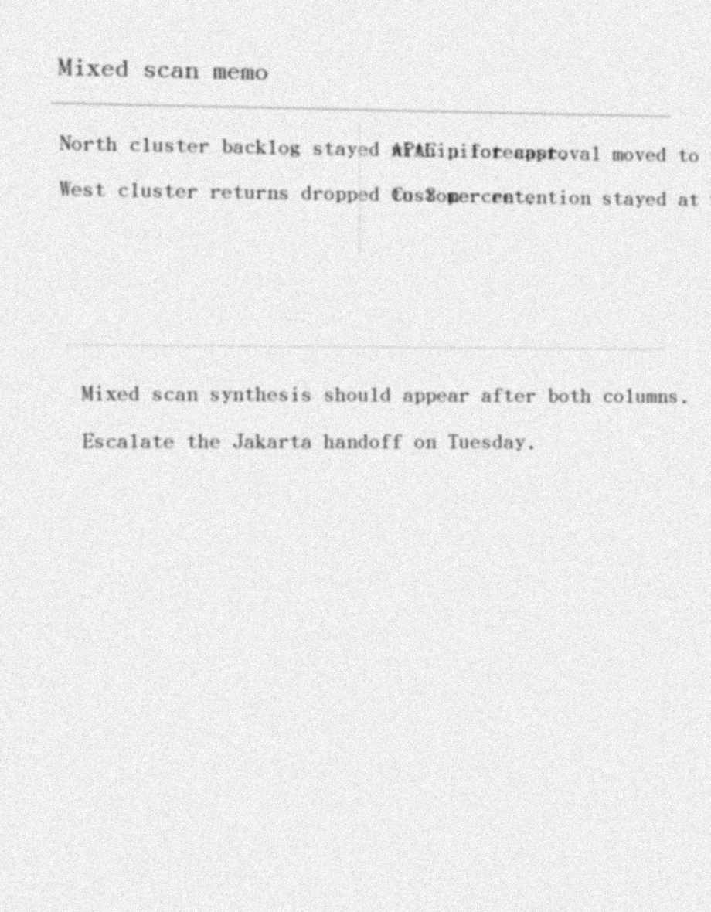

原始图片为脏扫描运营备忘录。

Image OCR:
Mixed scan memo.
North cluster backlog stayed within forecast.
West cluster returns dropped to 3 percent.
APAC pilot approval moved to wave 2.
Customer retention stayed at 94 percent.
Escalate the Jakarta handoff on Tuesday.
